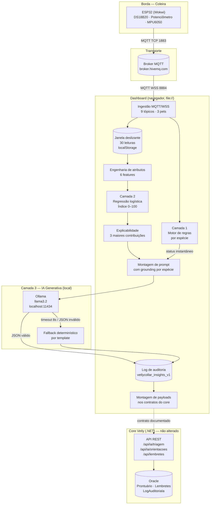
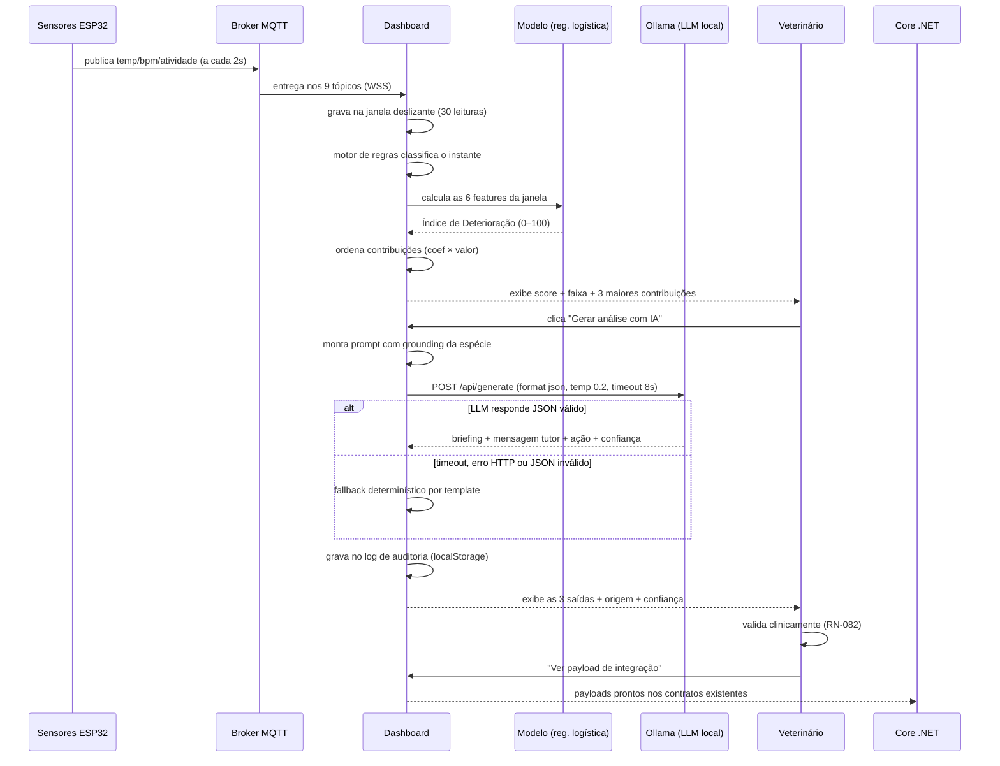

# Arquitetura da Camada de Inteligência Artificial — Vetly Collar

Sprint 3 · Disciplina *Disruptive Architectures: IoT, IoB & Generative IA*

| Equipe | RM |
|---|---|
| Anna Clara Russo Luca | 561928 |
| Gabriel Duarte Maciel | 565754 |
| Tiago Guedes da Costa | 564731 |
| Gustavo Tavares | 562827 |

---

## 1. O problema de negócio

A plataforma Vetly existe para transformar o cuidado do pet de **eventos pontuais**
(consultas isoladas, separadas por meses) em **jornada contínua**. O Vetly Collar
resolveu a primeira metade do problema no Sprint 1: passou a existir um fluxo
contínuo de dados fisiológicos e comportamentais.

Mas dado contínuo não é cuidado contínuo. O Sprint 1 entregou um **motor de regras
determinístico**: ele compara cada leitura com a faixa fisiológica da espécie e
classifica em Normal / Atenção / Crítico. Isso responde à pergunta *"este animal
está mal agora?"*. Restam três perguntas de negócio sem resposta:

1. **"Este animal está ficando pior?"** — Uma regra dispara quando o valor já cruzou
   o limiar. Nesse ponto o quadro clínico já se instalou. A janela de intervenção
   precoce — que é a proposta de valor inteira do monitoramento contínuo — já passou.
2. **"O que eu faço com essa informação?"** — Um card vermelho não diz ao veterinário
   o que priorizar, nem diz ao tutor se ele deve se preocupar.
3. **"Como isso vira ação dentro do sistema?"** — O alerta morre na tela se não
   virar triagem, orientação ou lembrete no core da plataforma.

A camada de IA do Sprint 3 responde às três, em três camadas distintas.

### Contribuição da IA para o negócio

| Eixo exigido pelo enunciado | Como a camada de IA entrega |
|---|---|
| **Personalização** | Todo cálculo é relativo ao perfil da espécie do paciente. O mesmo 38,6 °C gera índice baixo em cão e altíssimo em ave. O prompt do LLM recebe as faixas da espécie como *grounding* obrigatório. |
| **Priorização de ações** | O Índice de Deterioração (0–100) ordena a fila de pacientes por risco de trajetória, não por gravidade instantânea. A saída generativa fecha com um veredito operacional: `OBSERVAR`, `AGENDAR` ou `URGENCIA`. |
| **Recomendação de serviços** | A ação recomendada vira payload pronto para `POST /api/lembretes` (agendamento) e `POST /api/ia/triagem` (triagem assistida) no core .NET. |
| **Apoio à decisão** | O briefing técnico entra no prontuário como rascunho; a explicabilidade mostra *quais* fatores produziram o score. O veterinário valida (RN-082). |

---

## 2. As três camadas e a justificativa técnica de cada uma

Esta é a seção central do documento: **por que cada camada usa a técnica que usa.**

| Camada | Técnica adotada | Por que esta técnica | Por que não as alternativas |
|---|---|---|---|
| **1. Classificação instantânea** (Sprint 1, preservada) | Motor de regras determinístico sobre faixas fisiológicas por espécie | Faixas de temperatura e BPM por espécie são conhecimento veterinário consolidado e publicado. É determinístico, auditável, explicável sem esforço e roda em microssegundos. Um erro aqui é rastreável até a linha da regra. | Um modelo aprendido aqui seria complexidade sem ganho: aprenderia, com erro, uma função que já conhecemos exatamente. Introduziria incerteza estatística num ponto onde temos certeza literal. |
| **2. Detecção de deterioração** (novo) | **Regressão logística** sobre 6 features de janela deslizante | O sinal é um **padrão temporal multivariado** — a combinação de tendência térmica, instabilidade de ritmo e declínio comportamental. Regressão logística expõe **coeficientes diretamente interpretáveis**, o que é requisito prático em saúde: dá para dizer *"este score subiu porque a atividade caiu 62%"*. É leve o suficiente para rodar inteira no navegador, sem servidor de inferência. | **Rede neural:** caixa-preta injustificável para 6 features; nenhum ganho esperado com essa dimensionalidade e volume, e perda total de explicabilidade num domínio que a exige. **Árvore/ensemble (Random Forest, XGBoost):** ganho marginal de acurácia, custo alto de interpretabilidade (importância de feature ≠ contribuição por amostra) e exportar para JS sem build step seria hostil. **Limiar simples sobre tendência:** é o que já temos na camada 1; não captura interação entre sinais. |
| **3. Comunicação clínica** (novo) | **LLM local via Ollama** (`llama3.2`) | O mesmo estado clínico precisa virar **três linguagens diferentes**: técnica (veterinário), acolhedora e sem jargão (tutor) e operacional (ação do sistema). Tradução contextual de linguagem é exatamente o que um LLM faz melhor que qualquer regra. Rodando local, nenhum dado clínico sai da máquina. | **Templates fixos:** rígidos, não incorporam contexto de espécie nem a combinação específica de fatores; produzem texto robótico que o tutor ignora. (Mantidos apenas como *fallback* de resiliência.) **API de LLM em nuvem:** enviaria dado clínico para fora do perímetro, criando exposição de privacidade desnecessária e dependência de rede numa demo. |

### 2.1 A diferença que justifica a camada 2

> **As regras olham o instante. O modelo olha a trajetória.**

O Modo Demonstração do dashboard injeta uma deterioração em **duas fases**, que
reproduz a progressão clínica real e torna a diferença entre as camadas visível:

- **Fase 1 — pródromo comportamental (passos 1–22).** Temperatura e BPM sobem, mas
  permanecem **dentro da faixa da espécie** do primeiro ao último passo da fase. A
  atividade afunda progressivamente e o repouso fica fragmentado, em episódios de 2
  leituras. Para o motor de regras não está acontecendo nada: tudo dentro dos
  limites, e ele diz **Normal** durante a fase inteira. Para o modelo,
  `queda_atividade` e `fragmentacao_repouso` — as duas features de IoB — disparam.
- **Fase 2 — descompensação fisiológica (passos 23–34).** Só agora temperatura e
  BPM cruzam os limiares e o motor de regras reage.

Medição real sobre uma janela limpa de 30 leituras saudáveis de cão
(baseline: índice **3,3**, faixa Estável), verificada por `ia/verificar_demo.js`
em **10 execuções independentes**:

| Marco | Passo | O que o motor de regras dizia |
|---|---|---|
| Índice cruza 40 → faixa **Vigilância** | **10** (10/10) | Normal |
| Índice cruza 70 → faixa **Deterioração** | **14** (10/10) | Normal |
| Motor de regras sai de Normal → **Atenção** | 23–24 | — |
| Motor de regras muda para **Crítico** | 25–26 | — |

**O índice já está em faixa de Deterioração no passo 14, enquanto o motor de regras
ainda classifica o animal como Normal.** A separação entre "índice em Deterioração"
e "regra sai de Normal" foi de **9 a 10 passos em 10 de 10 execuções** — com o
intervalo de 700 ms da demo, isso equivale a **6,3 a 7,0 segundos de tela**, tempo
suficiente para narrar o ponto ao vivo.

A margem é construída no **pródromo**, não atrasando o motor de regras: as faixas
fisiológicas das espécies e os limiares do modelo (40/70) são exatamente os mesmos
usados em produção.

A antecipação aqui é **estrutural, não acidental**: o modelo enxerga
comportamento, e o comportamento se deteriora antes da fisiologia. Nenhuma regra
sobre faixas de temperatura e BPM poderia detectar a fase 1, porque durante toda
ela os valores estão dentro do normal.

> **Nota honesta sobre esta medição.** Ela já foi refeita duas vezes, e vale
> registrar por quê. Numa versão anterior, a margem parecia maior porque a
> `fragmentacao_repouso` estava saturada em todo animal, inclusive saudável: o score
> de base inflado fazia o índice "largar na frente" (ver `DADOS-IA.md` §2.3).
> Corrigido aquele defeito, a margem desabou — e a causa era um segundo problema, na
> própria demo: a fase 1 alternava atividade a **cada leitura**, e a histerese
> (corretamente) descartava tudo aquilo como ruído de sensor, de modo que o pródromo
> não gerava fragmentação nenhuma. Com os episódios em 2 leituras, a fase 1 passou a
> produzir sinal comportamental legítimo, e a margem atual é real e reprodutível.

---

## 3. Diagrama arquitetural



### 3.1 Fluxo de dados de uma análise completa



---

## 4. Prompt engineering

O prompt é montado em `montarPromptInsights(pet, perfil, leituras, indice, contribuicoes)`.

### 4.1 Estrutura

| Bloco | Conteúdo | Por quê |
|---|---|---|
| **Papel** | "assistente de apoio à decisão em medicina veterinária, integrado à coleira Vetly Collar" | Ancora o registro e o vocabulário. |
| **Regras obrigatórias** | Proibição explícita de diagnóstico definitivo e de prescrição; sujeição à validação humana (RN-082); resposta em pt-BR | Guardrail no próprio prompt, não só na interface. |
| **Contexto clínico** | Espécie, nome, idade, **faixas fisiológicas da espécie**, leitura atual, tendência, índice e as 3 maiores contribuições | É o *grounding*. Ver 4.3. |
| **Formato de saída** | JSON com exatamente 5 chaves | Torna a saída consumível por código, não só legível. |
| **Few-shot** | Um exemplo completo de saída bem formada (caso de febre em cão) | Fixa tom, comprimento e o formato do veredito. |

### 4.2 Parâmetros e a justificativa de cada um

| Parâmetro | Valor | Justificativa |
|---|---|---|
| `temperature` | **0.2** | Contexto clínico exige previsibilidade e aderência ao contexto fornecido, não criatividade. Temperatura alta produziria variação de recomendação entre execuções com o mesmo quadro — inaceitável em apoio à decisão. Não usamos 0 para não engessar a redação das mensagens ao tutor. |
| `format` | **`"json"`** | Força o Ollama a emitir JSON sintaticamente válido, eliminando a classe de erro mais comum (texto em volta do objeto). |
| `stream` | `false` | A resposta é consumida inteira de uma vez; streaming só adicionaria complexidade de parsing. |
| `num_predict` | 800 | Teto suficiente para as 5 chaves com folga, e baixo o bastante para respeitar o timeout de 8 s. |
| Timeout | **8 s** via `AbortController` | Acima disso a experiência quebra; o fallback assume. |

### 4.3 Grounding por espécie — a decisão de design mais importante do prompt

O prompt **sempre** injeta as faixas fisiológicas do paciente:

```
- Faixas fisiológicas de referência DESTA ESPÉCIE: temperatura 40–42 °C; batimentos 250–400 bpm
```

Sem essa linha, o LLM avalia qualquer paciente com a referência implícita de cão,
que é a mais representada nos dados de pré-treino. O resultado seria um erro
grosseiro e confiante: **41 °C é febre alta em um cão e é perfeitamente normal em
uma ave**; 300 bpm é taquicardia fatal em cão e repouso normal em ave.

É o mesmo princípio da camada 1 aplicado à camada 3: o sensor mede, o contexto da
espécie interpreta. Colocar esse contexto no prompt é o que impede o LLM de
"alucinar com confiança" sobre um paciente que ele avaliaria com a régua errada.

---

## 5. Guardrails

A IA em contexto de saúde opera sob restrição, não sob autonomia.

| Guardrail | Implementação | Regra de negócio |
|---|---|---|
| **A IA sugere, o humano decide** | Nenhuma saída da IA altera estado clínico automaticamente. O briefing é copiado para o prontuário por ação explícita do profissional. Aviso persistente na interface. | **RN-082** |
| **Proibição de diagnóstico definitivo** | Instrução explícita no prompt; a interface rotula tudo como hipótese/sugestão. | **RN-082** |
| **Proibição de prescrição** | Instrução explícita no prompt. Nenhum campo de dose existe na saída estruturada. | **RN-081** (sem peso, sem dose — e a coleira não mede peso, logo nunca sugere dose) |
| **Sem ampliação de acesso** | O contexto do prompt é montado exclusivamente com dados que o profissional já enxerga no dashboard. A IA não busca nada que o usuário não veria. | **RN-078** |
| **Rascunho, nunca documento final** | O payload de orientações carrega `validadoPorProfissional: false`. | **RN-080** |
| **Explicabilidade obrigatória** | O score nunca aparece sozinho: as 3 maiores contribuições (coeficiente × valor) são renderizadas junto, com barras proporcionais. | Decisão de design da equipe |
| **Rastreabilidade** | Cada geração é registrada em `localStorage` (`vetlycollar_insights_v1`): timestamp, pet, índice, features, origem e as três saídas. Espelha conceitualmente o `LogAuditoriaIa` do backend. | Decisão de design da equipe |
| **Resiliência** | Fallback determinístico garante que a ausência do LLM nunca produz tela quebrada nem erro no console. | Decisão de design da equipe |

---

## 6. Integração com o core .NET

O backend `vetly-.net` está **congelado e não foi alterado**. A integração
entregue aqui é a ponte **documentada e demonstrável**: a função
`montarPayloadsVetly(pet, indice, insight)` constrói os objetos JSON nos formatos
que os endpoints já existentes esperam, e o botão **"Ver payload de integração"**
os exibe na tela.

> **O argumento arquitetural:** a coleira não exigiu nenhuma alteração no backend.
> Ela fala os contratos que já existiam. Isso é desenho de integração por contrato
> e baixo acoplamento — a camada de IoT evolui sem arrastar o core junto.

### 6.1 Mapeamento campo a campo

Os nomes exatos das propriedades dos DTOs .NET não puderam ser verificados (o
repositório não faz parte desta entrega). Onde há incerteza, está marcado.

**`POST /api/ia/triagem` — corpo: `SintomasDto`**

| Campo do payload | Origem na coleira | Observação |
|---|---|---|
| `petId` | `PETS[].id` | Identificador do paciente; nome do campo assumido. |
| `especie` | `PERFIS[especie].nome` | **Suposição:** o DTO pode esperar um enum/ID em vez do rótulo textual. |
| `sintomasRelatados` | `insight.justificativa` (array de 1) | **Suposição:** assumido `List<string>`; pode ser um DTO estruturado de sintomas. |
| `temperaturaC` | `tempVigente(petId)` | Leitura vigente (sensor ou simulação). |
| `frequenciaCardiaca` | `bpmVigente(petId)` | Leitura vigente. |
| `nivelAtividade` | `actVigente(petId)` (0/1/2) | **Suposição:** campo pode não existir no DTO atual — é uma extensão natural vinda da coleira. |
| `indiceDeterioracao` | Score do modelo (0–100) | **Suposição:** campo novo; hoje o DTO provavelmente não o possui. É a informação que a coleira agrega ao contrato. |
| `origemDados` | Constante `"vetly-collar"` | **Suposição:** campo de procedência; útil para o core distinguir triagem por coleira de triagem manual. |

**`POST /api/ia/orientacoes` — corpo: `ConsultaResumoDto`**

| Campo do payload | Origem na coleira | Observação |
|---|---|---|
| `petId` | `PETS[].id` | Nome do campo assumido. |
| `resumoConsulta` | `insight.briefing_veterinario` | Texto técnico gerado pela camada 3. |
| `orientacoesTutor` | `insight.mensagem_tutor` | **Suposição:** o endpoint retorna `string` de orientações; aqui enviamos a versão já gerada localmente como rascunho. |
| `geradoEm` | `new Date().toISOString()` | ISO-8601 UTC. |
| `validadoPorProfissional` | `false` fixo | Materializa a RN-080 e a RN-082 no contrato: entra como rascunho. |

**`POST /api/lembretes` — corpo: `CriarLembreteDto`**

| Campo do payload | Origem na coleira | Observação |
|---|---|---|
| `petId` | `PETS[].id` | Nome do campo assumido. |
| `tipo` | `insight.acao_recomendada` | **Suposição:** o DTO provavelmente usa um enum próprio de tipo de lembrete; `OBSERVAR`/`AGENDAR`/`URGENCIA` precisaria de mapeamento. |
| `descricao` | `insight.justificativa` | Texto curto da recomendação. |
| `dataSugerida` | Agora + 0 d (URGENCIA) / 3 d (AGENDAR) / 30 d (OBSERVAR) | **Suposição:** regra de prazo definida por nós; o core pode ter política própria. |
| `origem` | Constante `"vetly-collar/insights"` | **Suposição:** campo de procedência. |

### 6.2 Motor de IA compartilhado

O backend usa **Ollama** através de `IOllamaService`. A coleira usa **o mesmo
motor**, chamando `localhost:11434` diretamente do navegador. Isso não é
coincidência de stack: significa que, ao promover esta camada para produção, a
chamada sai do navegador e passa a ser feita pelo backend, **reutilizando o
serviço de IA que já existe**, sem introduzir um segundo provedor de LLM, um
segundo conjunto de credenciais ou um segundo ponto de custo.

---

## 7. Limitações conhecidas

1. **Modelo treinado em dados sintéticos, e é por isso que as métricas são altas.**
   Não existe base pública de telemetria contínua multi-espécie rotulada
   clinicamente. O dataset codifica conhecimento veterinário estabelecido em cenários
   simulados — adequado para demonstrar a arquitetura, insuficiente para uso clínico.
   Um AUC de 0,9997 **não** indica um modelo quase perfeito: indica que os cenários
   simulados são bem separáveis pelas features projetadas para separá-los. Com dados
   reais — comorbidades, variação individual, rótulos ambíguos — o desempenho cairia
   substancialmente.
2. **11 falsos negativos em 400 janelas de risco (recall 0,9725).** Nenhum falso
   positivo. Em triagem clínica o trade-off correto é o inverso: falso negativo custa
   mais que falso alarme. Testamos `class_weight='balanced'` explicitamente e ele não
   muda nada, porque o dataset é balanceado por construção (ver `ia/METRICAS.md`); a
   alavanca real é o limiar de decisão, e o produto já opera abaixo de 0,5 ao alertar
   a partir de um score de 40.
3. **Escala temporal comprimida.** A janela de 30 leituras equivale a ~60 s na
   simulação e representaria ~24 h em produção. Ver `DADOS-IA.md`, seção
   "Escala temporal".
4. **Atividades basais estimadas.** Os valores de `ATIVIDADE_BASAL` por espécie
   são estimativas documentadas, não medições de campo.
5. **Sem validação cruzada de prompt.** A qualidade do texto gerado depende do
   modelo local instalado; `llama3.2` foi o alvo do ajuste. Modelos menores podem
   ignorar o formato JSON com mais frequência (e cair no fallback).
6. **Nomes de campos dos DTOs .NET não verificados** — ver as marcações de
   suposição na seção 6.1.

## 8. Próximos passos

- Substituir o dataset sintético por telemetria real rotulada por veterinários,
  e recalibrar o limiar de decisão priorizando recall.
- Mover a inferência do LLM para o backend, reutilizando `IOllamaService`, e
  persistir o log de auditoria no `LogAuditoriaIa` real em vez de `localStorage`.
- Estender a janela para a escala de 24 h com agregação por hora, viabilizando as
  features de IoB na escala em que elas têm significado clínico.
- Validar os nomes dos campos dos DTOs contra o repositório `.NET` e remover as
  suposições da seção 6.1.
