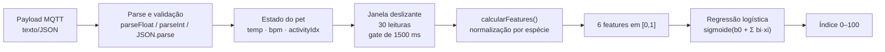

# Dados que alimentam a IA — Vetly Collar

Sprint 3 · Origem, estrutura, transformação e utilização de cada dado consumido
pela camada de Inteligência Artificial.

---

## 1. Dicionário de dados

### 1.1 Dados de telemetria (origem: sensores / simulação de borda)

| Dado | Origem | Estrutura | Unidade / faixa | Frequência | Utilização |
|---|---|---|---|---|---|
| `temperatura` | **pet001:** sensor DS18B20 (GPIO 4, OneWire). **pet002/003:** simulação no firmware com ruído gaussiano e drift biológico | `float` publicado como texto, 1 casa decimal | °C · ~30,0 a 45,0 | 2 s | Feature 1 (`desvio_termico`); motor de regras; contexto do prompt |
| `bpm` | **pet001:** potenciômetro (GPIO 34) mapeado para 50–220. **pet002/003:** simulação | `int` publicado como texto | batimentos/min · 20 a 450 | 2 s | Features 2 e 3 (`desvio_bpm`, `variabilidade_bpm`); feature 6; motor de regras; prompt |
| `atividade.idx` | **pet001:** MPU6050 (I²C 21/22) — magnitude do vetor de aceleração menos 9,81, dividida por 5 e truncada. **pet002/003:** simulação | `float` dentro de JSON | índice 0,0 a 1,0 | 2 s | **Features 4 e 5 (IoB)**; derivação do nível |
| `atividade.level` | Derivado de `idx` no firmware: `>0,65` → 2; `>0,25` → 1; senão 0 | `int` dentro de JSON | 0 (repouso) / 1 (ativo) / 2 (intenso) | 2 s | Feature 5 (transições) e feature 6 (repouso); cruzamento BPM × atividade; interface |
| `atividade.steps` | Contador acumulado no firmware | `unsigned long` dentro de JSON | passos | 2 s | Interface (card de atividade). Não alimenta o modelo |
| `atividade.mov_ms` | Tempo acumulado em movimento | `unsigned long` dentro de JSON | milissegundos | 2 s | Interface. Não alimenta o modelo |

**Tópicos MQTT** (broker `broker.hivemq.com`, `retain: true`):

```
vetlycollar/{petId}/temperatura     → "38.4"
vetlycollar/{petId}/bpm             → "92"
vetlycollar/{petId}/atividade       → {"level":1,"steps":128,"mov_ms":24000,"idx":0.42}
vetlycollar/{petId}/status          → {"temp":38.40,"bpm":92,"atv":0.42,"ts":123456}
```

> O tópico `status` é publicado pelo firmware mas **não é consumido** pelo
> dashboard — as três métricas individuais já cobrem a necessidade. Está
> documentado aqui por completude do contrato.

### 1.2 Dados cadastrais (origem: configuração da aplicação)

| Dado | Origem | Estrutura | Utilização |
|---|---|---|---|
| `id`, `nome`, `idade` | Array `PETS` em `index.html` (em produção viria do core .NET) | `string` | Identificação; contexto do prompt |
| `especie` | Array `PETS` | `string` ∈ {cao, gato, bovino, ave, coelho} | Seleciona o perfil fisiológico — chave de toda a personalização |

### 1.3 Perfis fisiológicos por espécie (origem: literatura veterinária)

Objeto `PERFIS` em `index.html`, replicado em `ia/gerar_dataset.py`. **Estes dois
precisam permanecer idênticos** — é a base da paridade entre treino e inferência.

| Espécie | Temp. mín (°C) | Temp. máx (°C) | BPM mín | BPM máx | Atividade basal (`idx`) |
|---|---|---|---|---|---|
| Cão | 37,5 | 39,2 | 60 | 140 | 0,30 |
| Gato | 38,0 | 39,2 | 140 | 220 | 0,35 |
| Bovino | 38,0 | 39,5 | 40 | 80 | 0,25 |
| Ave | 40,0 | 42,0 | 250 | 400 | 0,45 |
| Coelho | 38,5 | 40,0 | 130 | 325 | 0,40 |

**Sobre a atividade basal:** representa o índice médio de movimento de um animal
saudável em rotina normal, e é o denominador da feature `queda_atividade`. Os
valores de gato (0,35) e coelho (0,40) estão ancorados nos basais já usados pela
simulação do `sketch.ino` (`atvBase` de `pet002` e `pet003`); cão (0,30)
corresponde ao fallback do sensor real. Bovino (0,25) e ave (0,45) são
**estimativas da equipe** baseadas em perfil metabólico e comportamental — não
são medições de campo, e estão listadas como limitação em `ia/METRICAS.md`.

**Constantes de fragmentação do repouso** (feature 5):

| Constante | Valor | Papel |
|---|---|---|
| `PERSISTENCIA_MIN` | 2 leituras | Histerese: uma troca de estado só conta se o novo estado persistir por pelo menos 2 leituras seguidas |
| `FRAGMENTACAO_REF["cao"]` | 0,4924 | Divisor de normalização, por espécie |
| `FRAGMENTACAO_REF["gato"]` | 0,15 | (piso) |
| `FRAGMENTACAO_REF["bovino"]` | 0,8134 | |
| `FRAGMENTACAO_REF["coelho"]` | 0,15 | (piso) |
| `FRAGMENTACAO_REF["ave"]` | 0,15 | (piso) |
| `FRAGMENTACAO_PISO` | 0,15 | Piso do divisor |

Esses valores substituem um `FRAGMENTACAO_REF` global de 0,20 que tinha um defeito
de calibração — ver a seção 2.3, que documenta o problema, a medição e a correção.
A procedência dos números é `ia/calibrar_fragmentacao.py`, que mede a fragmentação
de animais saudáveis por espécie e deriva o divisor; rodar o script reproduz
exatamente a tabela acima.

### 1.4 Dados derivados (origem: camada de IA)

| Dado | Estrutura | Persistência | Utilização |
|---|---|---|---|
| Janela deslizante | `{labels[], temp[], bpm[], idx[]}`, 30 posições | `localStorage` → `vetlycollar_histories_v2` | Entrada de todas as features |
| 6 features | `float` cada, faixa [0,1] | Em memória | Entrada do modelo |
| Índice de Deterioração | `float` 0–100, 1 casa | Em memória + log de auditoria | Interface, prompt, payloads |
| Log de auditoria | Array de até 20 registros | `localStorage` → `vetlycollar_insights_v1` | Rastreabilidade das gerações de IA |

---

## 2. Pipeline de transformação — do MQTT à feature



### 2.1 As 6 features

Todas calculadas sobre a janela de N = 30 leituras, relativas ao perfil da
espécie, e normalizadas para [0,1]. **Não há scaler separado** — a normalização
está embutida na própria definição de cada feature, o que elimina uma classe
inteira de erro de paridade entre Python e JavaScript.

Seja `c = (min + max)/2` o centro da faixa fisiológica e `h = (max − min)/2` o
semi-intervalo.

| # | Feature | Fórmula | O que captura |
|---|---|---|---|
| 1 | `desvio_termico` | `z = (média_temp − c_temp)/h_temp`; resultado `= min(1, max(0, \|z\| − 1))` | Febre ou hipotermia **relativas à espécie**. Vale 0 enquanto a média estiver dentro da faixa; passa a crescer só quando a ultrapassa |
| 2 | `desvio_bpm` | Idem, com `c_bpm` e `h_bpm` | Taquicardia ou bradicardia relativas à espécie |
| 3 | `variabilidade_bpm` | `min(1, desvio_padrão(bpm) / média(bpm))` | Instabilidade autonômica — oscilação anormal do ritmo |
| 4 | `queda_atividade` | `min(1, max(0, 1 − média(idx)/basal_espécie))` | **IoB** — letargia; o primeiro sinal comportamental de dor e doença |
| 5 | `fragmentacao_repouso` | `min(1, (transições_confirmadas / (N−1)) / REF[espécie])`, onde uma transição só é *confirmada* se o novo estado durar ≥ 2 leituras | **IoB** — sono agitado, inquietação, desconforto |
| 6 | `taquicardia_repouso` | fração das leituras com `bpm > bpm_max` **e** `nível == 0` | O diferencial clínico do Sprint 1, agora como sinal quantitativo contínuo |

> **As features 4 e 5 são o coração do argumento de IoB.** O acelerômetro deixa de
> ser um enfeite: não medimos apenas fisiologia, medimos **comportamento**. E o
> modelo confirma a intuição clínica — `queda_atividade` é a feature de **maior
> peso** do modelo treinado (coeficiente +13,3322, 40,3% da importância relativa).

### 2.3 Correção de calibração da fragmentação do repouso

A feature 5 tinha um defeito de calibração que vale documentar, porque ilustra um
modo de falha típico de engenharia de atributos: **uma feature pode estar
matematicamente correta e mesmo assim medir a coisa errada.**

`LIMIAR_ATIVO` vale 0,25 (herdado do firmware) e a atividade basal de um cão
saudável é 0,30 — a apenas 0,05 de distância. No bovino é pior: a basal é
**exatamente** 0,25, em cima do limiar. Com o ruído normal do sensor (σ ≈ 0,08), um
animal saudável cruzava a fronteira repouso/ativo praticamente a cada leitura, a
contagem de transições explodia e a feature saturava em 1,0 — sinalizando
"inquietação máxima" para um animal que estava apenas deitado, respirando.

Medição em 300 janelas saudáveis por espécie, **antes** da correção:

| Espécie | Basal | P(leitura abaixo do limiar) | Saturava em 1,0 | Score de base | Entrava em Vigilância |
|---|---|---|---|---|---|
| Bovino | 0,25 | 50,0% | 100,0% | 35,0 | **19,7%** |
| Cão | 0,30 | 26,6% | 98,0% | 34,6 | **16,3%** |
| Gato | 0,35 | 10,6% | 56,0% | 24,5 | 7,0% |
| Coelho | 0,40 | 3,0% | 3,3% | 9,1 | 1,0% |
| Ave | 0,45 | 0,6% | 0,3% | 3,8 | 0,0% |

Quase um em cada cinco bovinos saudáveis entrava espontaneamente em Vigilância. E
como o mesmo cálculo estava no gerador do dataset, o defeito **contaminou o treino**:
o modelo aprendeu com janelas saudáveis que traziam fragmentação máxima.

**Correção, aplicada de forma idêntica em Python e JavaScript:**

1. **Histerese.** Uma troca de estado só é contada se o novo estado persistir por
   pelo menos 2 leituras consecutivas. A justificativa é física: um chaveamento de
   uma única leitura é indistinguível de ruído de sensor, ao passo que fragmentação
   real de repouso é um *episódio* — o animal levanta, fica um tempo de pé, volta a
   deitar — e portanto dura várias leituras.
2. **Referência por espécie.** O divisor global de 0,20 virou `FRAGMENTACAO_REF` por
   espécie, calibrado para que um animal saudável daquela espécie caia em torno de
   0,2 na feature, em vez de 1,0. O piso de 0,15 evita o erro simétrico: em espécies
   cuja basal está muito acima do limiar (coelho, ave), a média saudável é quase zero
   e um divisor minúsculo tornaria a feature hipersensível.

Resultado, mesmas 300 janelas saudáveis por espécie, **depois**:

| Espécie | Fragmentação média | Score médio | Score p95 | Entra em Vigilância |
|---|---|---|---|---|
| Cão | 0,201 | 8,8 | 19,0 | **0,0%** |
| Gato | 0,155 | 8,1 | 23,6 | **1,0%** |
| Bovino | 0,198 | 8,7 | 18,0 | **0,0%** |
| Coelho | 0,015 | 5,2 | 9,2 | **0,0%** |
| Ave | 0,002 | 4,5 | 6,9 | **0,0%** |

Verificado por `ia/verificar_base_saudavel.py`, que é executável como teste de
regressão e falha se qualquer espécie ultrapassar 2% de janelas saudáveis em faixa
de Vigilância.

Comportamento da histerese, validado em padrões sintéticos de borda (ver a tabela
abaixo, idêntica em Python e JavaScript):

| Padrão de atividade | Fragmentação resultante | Leitura |
|---|---|---|
| Alternância a cada leitura (ruído puro) | **0,000** | Descartado, que é o objetivo da correção |
| Episódios reais de 2 leituras | 0,59 – 1,00 | Preservado |
| Uma única mudança de estado (degrau) | 0,04 – 0,23 | Corretamente baixo |

### 2.2 Exemplo numérico completo e real

Janela gerada pelo cenário *febre em curso* para um **cão** (perfil: 37,5–39,2 °C,
60–140 bpm, basal 0,30). Valores reais produzidos por `gerar_dataset.py`:

```
temperatura (1ª..6ª): 38.31  38.59  38.54  38.72  38.76  38.70   ...  (3 últimas) 40.70  40.73  40.78
bpm         (1ª..6ª): 103.9   95.0  102.7  106.4  110.6  115.4   ...  (3 últimas) 156.0  153.1  155.0
idx         (1ª..6ª):  0.230  0.218  0.140  0.364  0.290  0.198   ...  (3 últimas)  0.248  0.354  0.267

média temp = 39.6136     média bpm = 128.33      média idx = 0.262858
níveis     = [0,0,0,1,1,0,1,0,0,1,1,1,1,0,0,1,1,0,0,1,1,0,0,0,0,0,1,0,1,1]
```

Aplicando as fórmulas:

| Feature | Cálculo | Resultado |
|---|---|---|
| `desvio_termico` | `c=38,35  h=0,85  z=(39,6136−38,35)/0,85=1,4866` → `min(1, 1,4866−1)` | **0,486575** |
| `desvio_bpm` | `c=100  h=40  z=(128,33−100)/40=0,7083` → `\|z\|−1 < 0` → truncado em 0 | **0,000000** |
| `variabilidade_bpm` | `desvio_padrão(bpm)/média(bpm) = 16,6005/128,33` | **0,129360** |
| `queda_atividade` | `1 − (0,262858/0,30)` | **0,123805** |
| `fragmentacao_repouso` | 13 trocas brutas, mas só **9 confirmadas** pela histerese; `(9/29)/0,4924 = 0,310345/0,4924` | **0,630270** |
| `taquicardia_repouso` | 6 leituras com bpm > 140 e nível 0, de 30 | **0,200000** |

> A feature 5 é o exemplo concreto da correção da seção 2.3: das 13 trocas de estado
> brutas, 4 eram chaveamento de uma única leitura e foram descartadas. Com o divisor
> global antigo (0,20) esta janela **saturava em 1,000**; com a histerese e a
> referência do cão ela vale **0,630** — alto, porque há fragmentação real, mas sem
> estourar a escala e sem confundir ruído de sensor com sinal clínico.

Aplicando o modelo (coeficientes reais de `modelo_coeficientes.json`):

```
z = −3,367645
  + 8,770894 × 0,486575    (desvio_termico)       = +4,267701
  + (−2,002010) × 0,000000 (desvio_bpm)           =  0,000000
  + 4,099415 × 0,129360    (variabilidade_bpm)    = +0,530302
  + 13,332201 × 0,123805   (queda_atividade)      = +1,650598
  + 2,309267 × 0,630270    (fragmentacao_repouso) = +1,455461
  + 2,594938 × 0,200000    (taquicardia_repouso)  = +0,518988

z = 5,055404     →     índice = sigmoide(5,055404) × 100 = 99,37
```

Faixa resultante: **Deterioração** (≥ 70). As três maiores contribuições exibidas
na interface seriam, nesta ordem: desvio térmico (4,27), queda de atividade (1,65)
e fragmentação do repouso (1,46) — exatamente o raciocínio clínico de um quadro
febril acompanhado de letargia e sono agitado.

---

## 3. Escala temporal: simulação vs. produção

**Esta é uma limitação assumida e explícita da demonstração.**

O firmware publica a cada 2 segundos. Uma janela de 30 leituras equivale, portanto,
a **cerca de 60 segundos** na simulação do Wokwi. Em produção, as features de
comportamento (IoB) só têm significado clínico numa escala de **24 horas** — não
existe "fragmentação de sono" mensurável em um minuto.

| Feature | Janela da demo (30 × 2 s ≈ 1 min) | Janela de produção | A matemática muda? |
|---|---|---|---|
| `desvio_termico` | Média de ~1 min | Média móvel de 4–6 h | Não |
| `desvio_bpm` | Média de ~1 min | Média móvel de 4–6 h | Não |
| `variabilidade_bpm` | CV de 30 amostras | CV de amostras agregadas por hora em 24 h | Não |
| `queda_atividade` | vs. basal da espécie | vs. basal **do próprio animal**, aprendida em 7–14 dias | Não — muda apenas o denominador |
| `fragmentacao_repouso` | Transições em ~1 min | Transições durante o período noturno de 8 h | Não |
| `taquicardia_repouso` | Fração de 30 amostras | Fração das amostras em repouso em 24 h | Não |

**A matemática é idêntica; apenas o tempo está comprimido para caber numa
demonstração ao vivo.** As fórmulas, os coeficientes e os limiares não mudariam —
mudaria a taxa de agregação na entrada da janela.

Uma consequência honesta: na escala comprimida, `queda_atividade` usa a basal da
**espécie**; em produção o correto seria a basal **do indivíduo**, aprendida ao
longo de dias. Um galgo e um buldogue têm basais muito diferentes, e a
personalização real exige esse histórico por animal.

---

## 4. Dataset sintético

Gerado por `ia/gerar_dataset.py` → `ia/dataset_sintetico.csv`.
**4.000 amostras**, semente fixa `random_state=42` (totalmente reprodutível).

Cada amostra é uma janela de 30 leituras simuladas a partir de um cenário clínico,
sorteada entre as 5 espécies e passada pelo **mesmo cálculo de features** usado em
produção.

| Cenário | Amostras | Proporção | Rótulo `risco` | Descrição |
|---|---|---|---|---|
| `saudavel` | 1600 | 40% | 0 | Valores no centro da faixa, ruído gaussiano leve, atividade na basal |
| `atividade_intensa` | 400 | 10% | 0 | BPM ~10% acima do máximo **com** atividade alta (idx ~0,80) |
| `febre` | 600 | 15% | 1 | Temperatura em rampa até ultrapassar o máximo, BPM acompanhando |
| `taquicardia_repouso` | 600 | 15% | 1 | BPM ~25% acima do máximo **com** atividade quase nula |
| `letargia` | 480 | 12% | 1 | Episódios alternados de repouso e atividade (2 a 4 leituras cada) sobre um declínio global de atividade |
| `hipotermia_choque` | 320 | 8% | 1 | Temperatura em rampa abaixo do mínimo, bradicardia, atividade ~0 |

Distribuição final: **2.000 amostras de risco e 2.000 sem risco** — balanceado por
construção, o que torna acurácia uma métrica legível sem correção de classe. É
também por isso que `class_weight='balanced'` não altera nada no treino: com as duas
classes já equilibradas, ele atribui peso 1,0 a ambas. Ver `ia/METRICAS.md`.

> **Nota sobre o cenário `letargia`.** Ele gerava, originalmente, picos de atividade
> de **uma única leitura**. Isso era fisicamente implausível (um episódio de
> inquietação dura mais que 2 segundos) e, depois da introdução da histerese na
> feature 5, esses picos passariam a ser corretamente descartados como ruído —
> deixando o cenário sem o sinal de fragmentação que ele existe para representar. O
> gerador foi corrigido para produzir episódios reais de 2 a 4 leituras. Não é
> ajustar o dado para agradar o modelo: é tornar a simulação consistente com a
> definição física do fenômeno que ela simula.

### 4.1 O cenário `atividade_intensa` é a armadilha deliberada

Sem ele, o modelo aprenderia o atalho preguiçoso **"BPM alto = ruim"** e se
tornaria um limiar caro — exatamente o que a camada 1 já faz de graça, e sem o
contexto de atividade.

Com ele, o modelo é obrigado a aprender que BPM elevado **com** atividade alta é
fisiológico, e que o sinal clínico está na **combinação** de BPM elevado com
repouso. O efeito aparece no modelo treinado de forma mensurável e verificável:

> `desvio_bpm` terminou com coeficiente **negativo** (−2,0020), enquanto
> `taquicardia_repouso` ficou em **+2,5949**.

Ou seja: o modelo aprendeu que desvio de BPM **isolado** não é evidência de risco
(está confundido com exercício legítimo), e que o que importa é o BPM alto
**qualificado pelo estado comportamental**. Esse é precisamente o diferencial
clínico do produto, agora aprendido a partir dos dados em vez de codificado à mão.

### 4.2 Por que dados sintéticos são metodologicamente aceitáveis nesta fase

1. **Não existe base pública equivalente.** Não há dataset aberto de telemetria
   contínua, multi-espécie, com rótulo clínico longitudinal. Coletar uma exigiria
   um estudo veterinário com aprovação ética — fora do escopo e do prazo.
2. **O dataset codifica conhecimento estabelecido.** As faixas fisiológicas vêm da
   literatura; os cenários reproduzem apresentações clínicas descritas
   (febre com taquicardia secundária, hipotermia com bradicardia, letargia como
   pródromo comportamental).
3. **O objetivo aqui é arquitetural.** A entrega demonstra o *pipeline* completo —
   engenharia de atributos, treino, avaliação, exportação, paridade entre
   linguagens e inferência em produção. Esse pipeline é exatamente o mesmo quando
   o CSV passar a vir de animais reais; troca-se a fonte, não a arquitetura.
4. **É declarado com honestidade.** As métricas medem separabilidade **dos
   cenários simulados**, não desempenho clínico real. Isso está escrito em
   `ia/METRICAS.md`, em `ARQUITETURA-IA.md` e aqui.

---

## 5. Privacidade e LGPD

| Aspecto | Situação nesta entrega | Observação |
|---|---|---|
| **Dado pessoal do tutor** | Nenhum é coletado, transmitido ou armazenado pela coleira | Nome, CPF e contato vivem no core .NET, fora deste escopo |
| **Dado do animal** | Nome, espécie, idade e telemetria | Dado de animal não é dado pessoal em si, mas é **vinculável** ao tutor no core — logo é tratado como sensível por precaução |
| **Trânsito na demo** | MQTT em **broker público** (`broker.hivemq.com`), sem criptografia de payload | **Limitação explícita da demonstração acadêmica.** Em produção: broker privado, TLS mútuo e tópicos autenticados por dispositivo |
| **Retenção local** | 30 leituras por pet + 20 registros de auditoria, em `localStorage` | Limpável pelo botão "Limpar histórico" e pelo próprio navegador; nada é enviado para servidor externo |
| **Inferência do modelo preditivo** | 100% no navegador | Nenhum dado sai da máquina para calcular o índice |
| **Inferência do LLM** | 100% local, via Ollama em `localhost:11434` | **Argumento forte de privacidade por design:** nenhum dado clínico é enviado para OpenAI, Anthropic, Google ou qualquer terceiro. O texto clínico nunca cruza a fronteira da máquina |
| **Minimização (RN-078)** | O prompt recebe apenas o que o profissional já vê na tela | A IA não amplia o acesso de ninguém |
| **Rastreabilidade** | Log de auditoria com timestamp, features, origem e saídas | Permite reconstruir *por que* a IA sugeriu o que sugeriu |

A escolha de LLM local é, simultaneamente, uma decisão de **privacidade**
(nenhum dado clínico sai do perímetro), de **custo** (sem cobrança por token) e de
**resiliência** (funciona sem internet). É o tipo de decisão que fica mais difícil
de reverter depois — por isso foi tomada desde o início.
