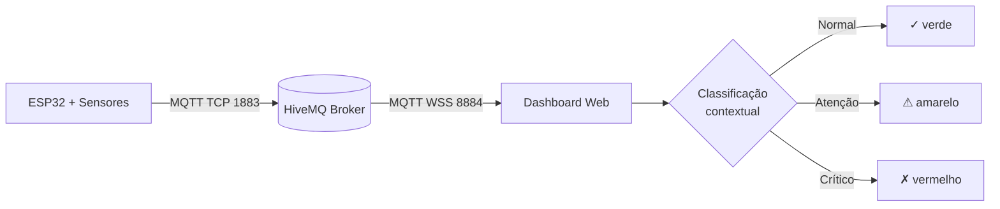

# ClivoVET — Coleira Inteligente Multi-Pet

> Saúde animal contínua através de IoT, IA contextual e dados longitudinais.


---

## O problema

O mercado pet brasileiro movimenta cerca de **R$ 75 bilhões por ano** e segue crescendo em dois dígitos. Apesar do volume, o cuidado clínico continua estruturado em torno de eventos pontuais: o tutor leva o animal à clínica quando algo já está visivelmente errado. Entre uma consulta e a próxima, existe um vácuo de meses sem nenhum dado fisiológico — e é justamente nesse intervalo que doenças silenciosas se instalam.

Veterinários sabem disso há décadas, mas faltava um canal escalável para monitoramento contínuo. Tutores percebem mudanças sutis tarde demais. Clínicas perdem janelas críticas de intervenção precoce. O gap entre **consulta pontual** e **monitoramento contínuo** é onde nasce a ClivoVET.

## Solução: ClivoVET

ClivoVET é uma plataforma de saúde animal contínua que conecta clínicas, tutores e pets através de uma coleira inteligente IoT e uma camada de inteligência clínica contextual. O diferencial central é o **multi-espécie por software**: o mesmo hardware mede cão, gato, ave ou coelho — a interpretação clínica é que muda. Uma temperatura de **38.6°C é perfeitamente normal em um cão**, mas é **hipotermia grave em uma ave** (que opera entre 40 e 42°C). O sensor mede; o software contextualiza pela espécie.

## Por que IoT?

- **Dados longitudinais** — em vez de uma fotografia por consulta, uma série temporal contínua que revela padrões e tendências invisíveis a olho nu.
- **Alerta proativo** — taquicardia em repouso, febre noturna, queda abrupta de atividade são detectadas no momento em que acontecem, não dias depois.
- **Escalabilidade** — uma única coleira atende qualquer espécie compatível; a inteligência clínica vive na nuvem e evolui sem mexer no hardware.

## Arquitetura

```
┌─────────────────────────────────────────┐
│ ESP32 (Wokwi)                           │
│  ├─ DS18B20 (GPIO 4)         → temp     │
│  ├─ Potenciômetro (GPIO 34)  → BPM      │
│  └─ MPU6050 (I²C 21/22)      → atividade│
└─────────────────────────────────────────┘
                ↓ MQTT (TCP 1883)
┌─────────────────────────────────────────┐
│ Broker HiveMQ público                   │
│   broker.hivemq.com                     │
└─────────────────────────────────────────┘
                ↓ MQTT (WSS 8884)
┌─────────────────────────────────────────┐
│ Dashboard HTML (navegador, file://)     │
│  Multi-pet · Chart.js · localStorage    │
└─────────────────────────────────────────┘
```



## Funcionalidades implementadas no Sprint 1

- ✅ Firmware ESP32 lendo **3 sensores físicos** simultâneos (temperatura, BPM, atividade)
- ✅ Publicação MQTT em **9 tópicos** (3 pets × 3 métricas) a cada 2 segundos
- ✅ **Multi-pet nativo**: 1 pet real (Rex) + 2 virtuais (Mimi gato, Tobi coelho) com ruído gaussiano e drift biológico
- ✅ Dashboard responsivo conectado via **WebSocket Secure** (porta 8884)
- ✅ **Classificação clínica contextual** por espécie (Normal / Atenção / Crítico)
- ✅ **Cruzamento BPM × atividade** detectando taquicardia em repouso
- ✅ Indicadores de **tendência** (↗ ↘ →) nas últimas 5 leituras
- ✅ Gráfico Chart.js com histórico de 30 leituras, **persistente via localStorage**
- ✅ Painel de simulação com **sliders manuais e 5 presets clínicos** por espécie
- ✅ Reconexão automática Wi-Fi + MQTT em duas camadas
- ✅ Mensagens MQTT com `retain: true` para snapshot imediato ao conectar

## Stack técnico

| Tecnologia | Versão | Finalidade |
|---|---|---|
| ESP32 DevKit-C v4 | Arduino core | Microcontrolador principal (simulado no Wokwi) |
| DS18B20 | OneWire 1-wire | Sensor de temperatura |
| MPU6050 | I²C | Acelerômetro para índice de atividade |
| PubSubClient | 2.8+ | Cliente MQTT no firmware |
| HiveMQ público | broker.hivemq.com | Broker MQTT (portas 1883 / 8884) |
| Chart.js | 4.4.0 | Gráficos de séries temporais no dashboard |
| mqtt.js | CDN unpkg | Cliente MQTT no navegador (WSS) |
| HTML/CSS/JS | Vanilla | Frontend sem build step |
| Inter | Google Fonts | Tipografia |

## Como executar

### A. Rodar o firmware no Wokwi

1. Acesse [wokwi.com](https://wokwi.com) e crie um **novo projeto ESP32**.
2. Copie o conteúdo de `firmware/sketch.ino` para a aba `sketch.ino` do Wokwi.
3. Copie `firmware/diagram.json` para a aba `diagram.json` (define o circuito visual).
4. No Library Manager do Wokwi (ícone de livro), adicione:
   - `PubSubClient`
   - `OneWire`
   - `DallasTemperature`
   - `Adafruit MPU6050`
   - `Adafruit Unified Sensor`
5. Clique em **Play** ▶. O Serial Monitor deve mostrar conexão Wi-Fi e MQTT em poucos segundos.

```bash
# Saída esperada no Serial Monitor:
# [WiFi] Conectado | IP: 10.0.0.2
# [MQTT] Conectado ao broker.hivemq.com
# [PUB] clivovet/pet001/temperatura 38.4
# [PUB] clivovet/pet001/bpm 92
# [PUB] clivovet/pet001/atividade 0.42
```

### B. Abrir o dashboard

1. Baixe o arquivo `dashboard/index.html` para qualquer pasta local.
2. Dê **duplo clique** no arquivo — abre direto no navegador via `file://`.
3. O dashboard conecta automaticamente ao broker e começa a receber os 3 pets em segundos.

Não precisa de servidor, sem `npm install`, sem build. Funciona offline depois do primeiro carregamento das CDNs.

## Demonstração multi-espécie

Cenários guiados que evidenciam o diferencial contextual da plataforma:

1. **Mesmo BPM, diagnósticos opostos** — Com o Rex (cão) selecionado, ajuste o BPM virtualmente para `200`. Status: **Crítico** (acima de 140). Troque para a Mimi (gato): mesmos `200` viram **Atenção** (faixa de gato vai até 220). Troque para um perfil de ave: `200` agora é **Crítico por baixo** (aves começam em 250).

2. **Temperatura idêntica, leituras opostas** — Defina `38.6°C` no Rex → **Normal**. Reclassifique o pet como ave → **Hipotermia crítica** (ave saudável opera entre 40 e 42°C). O número não mudou; o contexto sim.

3. **Cruzamento BPM × atividade** — Aplique o preset *Taquicardia* no Tobi (coelho) com atividade em **Repouso**. O dashboard exibe o alerta: **"Taquicardia em repouso — sinal clínico relevante"**. Mude a atividade para **Em movimento** e o alerta desaparece: o mesmo BPM agora tem explicação fisiológica.

4. **Recuperação visual** — Aplique o preset *Febre* no Rex, observe o gráfico subir e o card ficar vermelho. Aplique *Saudável*: o gráfico desce em rampa suave (não em degrau), porque o pet virtual aplica drift gradual — parece biológico.

## Estrutura de pastas

```
clivovet-coleira-iot/
├── README.md                  # este arquivo
├── LICENSE                    # MIT
├── docs/
│   ├── arquitetura.md         # detalhamento técnico
│   ├── pitch-roteiro.md       # roteiro do vídeo de 5 min
│   └── imagens/               # screenshots do dashboard e Wokwi
├── firmware/
│   ├── sketch.ino             # código Arduino do ESP32
│   ├── diagram.json           # circuito Wokwi (sensores + ligações)
│   └── wokwi.toml             # config do projeto Wokwi
└── dashboard/
    └── index.html             # dashboard single-file, sem build
```

## Inteligência cruzada (recurso destaque)

O ponto alto clínico do Sprint 1 é o **cruzamento BPM × atividade**. Frequência cardíaca isolada diz pouco: um cão com 180 bpm correndo está fisiologicamente normal; o mesmo cão com 180 bpm dormindo tem alta probabilidade de patologia cardíaca, hipertireoidismo ou dor.

O algoritmo aplica três regras combinadas:

| BPM | Atividade | Interpretação |
|---|---|---|
| Alto para a espécie | Repouso | **Taquicardia em repouso** — alerta clínico relevante |
| Alto para a espécie | Movimento | Esperado (esforço físico) |
| Baixo para a espécie | Repouso | Possível bradicardia — monitorar |
| Baixo para a espécie | Movimento | **Anomalia grave** — escalada imediata |

Esse cruzamento muda a gravidade do status mesmo quando os valores brutos não disparariam alerta sozinhos. É a diferença entre um *monitor de números* e uma *coleira clínica*.

### Perfis clínicos implementados

| Espécie | Temperatura (°C) | BPM (repouso) |
|---|---|---|
| Cão | 37.5 – 39.2 | 60 – 140 |
| Gato | 38.0 – 39.2 | 140 – 220 |
| Bovino | 38.0 – 39.5 | 40 – 80 |
| Ave | 40.0 – 42.0 | 250 – 400 |
| Coelho | 38.5 – 40.0 | 130 – 325 |

**Regra de classificação:** Normal se ambos dentro da faixa; Atenção se desvio ≤ 5% do limite; Crítico se desvio > 5%. Quando ambos estão fora, prevalece o pior caso.

## Resultados do Sprint 1

Autoavaliação contra os critérios da rubrica:

| Critério | Avaliação | Evidência |
|---|---|---|
| Funcionalidade do MVP | ✅ Atende plenamente | 3 sensores físicos + 3 pets simultâneos publicando em 9 tópicos MQTT, dashboard recebendo em tempo real |
| Integração IoT ponta-a-ponta | ✅ Atende plenamente | ESP32 → HiveMQ → Browser via WSS, com reconexão automática e mensagens `retain` |
| Diferencial técnico defensável | ✅ Atende plenamente | Multi-espécie contextual + cruzamento BPM × atividade implementado e demonstrável ao vivo |

## Roadmap

- **Sprint 2** — Camada preditiva com regressão sobre tendência: detectar deterioração antes do limiar crítico.
- **Sprint 3** — IA Generativa traduzindo o estado clínico em linguagem natural ("Rex apresentou febre noturna entre 02h e 04h, padrão compatível com processo infeccioso").
- **Sprint 4** — App do tutor (notificações push, histórico exportável, agendamento) e integração via API com sistemas de gestão de clínicas veterinárias.

## Equipe

[Nome 1, Nome 2, Nome 3]

## Licença

Distribuído sob a licença MIT. Veja [LICENSE](LICENSE) para detalhes.