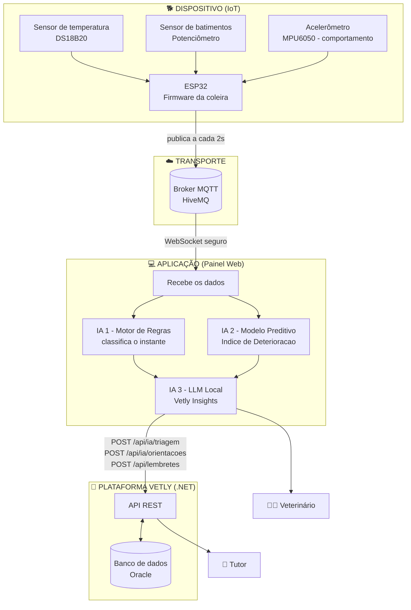
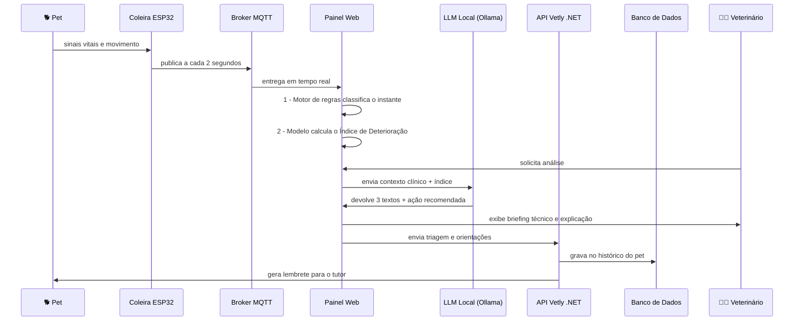

# Vetly Collar — Coleira Inteligente com IA

**Disciplina:** Disruptive Architectures: IoT, IoB & Generative IA
**Entrega:** 3º Sprint

## Equipe

| Nome | RM |
|---|---|
| Anna Clara Russo Luca | 561928 |
| Gabriel Duarte Maciel | 565754 |
| Tiago Guedes da Costa | 564731 |
| Gustavo Tavares | 562827 |

---

## O que é este projeto

Uma coleira inteligente que monitora a saúde do pet 24 horas por dia e usa Inteligência Artificial para avisar quando algo começa a dar errado — antes que o tutor perceba.

O projeto tem três partes:

1. **Hardware** — um ESP32 com três sensores, simulado no Wokwi
2. **Comunicação** — os dados vão para a nuvem por MQTT
3. **Inteligência** — um painel web que recebe os dados e aplica três camadas de IA

---

## 📍 Onde encontrar cada item da avaliação

Esta tabela existe para facilitar a correção. Cada exigência da disciplina está em um lugar específico.

| O que a disciplina pede | Onde está |
|---|---|
| Problema de negócio tratado pela IA | Seção 1 deste README |
| Abordagem de IA escolhida e justificada | Seção 3 deste README |
| Como a IA personaliza, prioriza e apoia decisões | Seção 4 deste README |
| Dados usados (origem, estrutura, utilização) | Seção 5 deste README e `DADOS-IA.md` |
| Fluxo de dados entre usuário, app, banco e IA | Seção 6 deste README |
| Diagrama arquitetural | Seção 2 e Seção 6 deste README |
| Resultados e métricas do modelo | Seção 7 deste README e `ia/METRICAS.md` |
| Instruções de uso | Seção 8 deste README |
| Tecnologias utilizadas | Seção 10 deste README |

---

## 1. O problema de negócio

Hoje o cuidado veterinário funciona por **eventos isolados**: o tutor leva o animal à clínica quando o problema já está visível.

Entre uma consulta e a próxima passam meses sem nenhuma informação sobre o animal. É nesse vazio que doenças silenciosas se instalam.

O problema em números:

- O mercado pet brasileiro movimenta cerca de **R$ 75 bilhões por ano**
- Mesmo assim, o tutor só percebe mudanças sutis **tarde demais**
- A clínica perde a janela em que o tratamento seria mais simples e mais barato

**O que a IA resolve:** transformar o cuidado de eventos isolados em uma **jornada contínua**, detectando a deterioração da saúde enquanto os sinais ainda são sutis.

---

## 2. A solução e a arquitetura

O mesmo hardware serve cão, gato, ave, coelho ou bovino. **O que muda é a interpretação, não o sensor.**

> Uma temperatura de **38,6 °C é normal em um cão**, mas é **hipotermia grave em uma ave** — que opera entre 40 e 42 °C.

O sensor mede. O software decide o que aquilo significa para aquela espécie.

### Diagrama da arquitetura


```mermaid
flowchart TB
    subgraph DISPOSITIVO["🐕 DISPOSITIVO (IoT)"]
        S1[Sensor de temperatura<br/>DS18B20]
        S2[Sensor de batimentos<br/>Potenciômetro]
        S3[Acelerômetro<br/>MPU6050 - comportamento]
        ESP[ESP32<br/>Firmware da coleira]
        S1 --> ESP
        S2 --> ESP
        S3 --> ESP
    end

    subgraph NUVEM["☁️ TRANSPORTE"]
        MQTT[(Broker MQTT<br/>HiveMQ)]
    end

    subgraph APP["💻 APLICAÇÃO (Painel Web)"]
        REC[Recebe os dados]
        IA1[IA 1 - Motor de Regras<br/>classifica o instante]
        IA2[IA 2 - Modelo Preditivo<br/>Indice de Deterioracao]
        IA3[IA 3 - LLM Local<br/>Vetly Insights]
        REC --> IA1
        REC --> IA2
        IA1 --> IA3
        IA2 --> IA3
    end

    subgraph BACKEND["🏥 PLATAFORMA VETLY (.NET)"]
        API[API REST]
        DB[(Banco de dados<br/>Oracle)]
        API <--> DB
    end

    ESP -->|publica a cada 2s| MQTT
    MQTT -->|WebSocket seguro| REC
    IA3 -->|POST /api/ia/triagem<br/>POST /api/ia/orientacoes<br/>POST /api/lembretes| API

    VET[👨‍⚕️ Veterinário]
    TUT[👤 Tutor]
    IA3 --> VET
    API --> TUT
```

**Ponto importante da arquitetura:** a coleira conversa com a plataforma Vetly usando endpoints que **já existiam**. Nenhuma linha do backend precisou ser alterada para a coleira funcionar.

---

## 3. Abordagem de IA escolhida e justificativa

Não usamos uma única técnica. Usamos **três**, porque são três problemas diferentes.

| Camada | Técnica de IA | Qual problema resolve | Por que esta técnica |
|---|---|---|---|
| **1** | **Motor de regras inteligentes** | O valor de agora está fora da faixa da espécie? | As faixas fisiológicas são conhecimento veterinário consolidado. Um modelo aqui só traria complexidade sem ganho. Regra é rápida, auditável e nunca erra o óbvio. |
| **2** | **Modelo preditivo** (regressão logística) | O animal está piorando, mesmo com os valores ainda normais? | Aqui existe um padrão que envolve **seis variáveis ao mesmo tempo, ao longo do tempo**. Regra não dá conta disso. Escolhemos regressão logística porque os coeficientes são **interpretáveis** — em saúde, não podemos usar caixa-preta. |
| **3** | **IA Generativa (LLM local)** | Como explicar o mesmo quadro clínico para públicos diferentes? | O veterinário precisa de termo técnico, o tutor precisa de linguagem simples. Traduzir contexto para linguagem natural é exatamente o que um LLM faz melhor que qualquer template fixo. |

### Por que descartamos outras opções

- **Rede neural:** seria caixa-preta e injustificável para apenas 6 variáveis.
- **Árvore de decisão / ensemble:** ganho marginal de precisão com perda grande de interpretabilidade.
- **Templates de texto fixos:** não se adaptam ao contexto clínico nem à espécie.

### A diferença entre a camada 1 e a camada 2

> **As regras olham o instante. O modelo olha a trajetória.**

É por isso que o modelo consegue avisar antes. Demonstramos isso funcionando na Seção 7.

---

## 4. Como a IA gera valor

### Personalização

Todo cálculo é **relativo à espécie do paciente**. O mesmo número gera resultados opostos:

| Valor medido | Em um cão | Em uma ave |
|---|---|---|
| 38,6 °C | Normal | Hipotermia crítica |
| 200 bpm | Crítico | Abaixo do normal |

O LLM também recebe as faixas da espécie antes de escrever qualquer coisa. Sem isso, ele avaliaria um coelho com referência de cachorro.

### Priorização de ações

O Índice de Deterioração dá uma nota de **0 a 100** para cada animal. A clínica sabe **quem atender primeiro** sem precisar abrir prontuário por prontuário.

| Faixa | Nota | O que significa |
|---|---|---|
| 🟢 Estável | 0 a 39 | Nada a fazer |
| 🟡 Vigilância | 40 a 69 | Acompanhar de perto |
| 🔴 Deterioração | 70 a 100 | Ação recomendada |

### Recomendação de serviço

O Vetly Insights sempre devolve uma ação concreta: **OBSERVAR**, **AGENDAR** ou **URGÊNCIA**. Quando a recomendação é agendar, isso vira uma sugestão de consulta dentro da plataforma Vetly.

### Apoio à tomada de decisão

O sistema **nunca dá um diagnóstico fechado**. Ele entrega hipóteses e contexto, e o veterinário decide. Isso segue a regra **RN-082** da plataforma Vetly: *a IA sugere, o profissional valida*.

Além disso, o painel **nunca mostra o número sozinho**. Junto com a nota, ele mostra as três informações que mais pesaram naquele resultado. O veterinário vê de onde veio a conclusão.

---

## 5. Dados usados pela IA

### 5.1 Dados que vêm da coleira (tempo real)

| Dado | Origem | Estrutura | Como é usado |
|---|---|---|---|
| Temperatura | Sensor DS18B20 | Número decimal, °C | Detecta febre e hipotermia |
| Batimentos | Sensor de pulso | Número inteiro, bpm | Detecta taquicardia e bradicardia |
| Atividade | Acelerômetro MPU6050 | Número de 0 a 1 | **Comportamento (IoB)**: letargia e agitação |

Os três chegam a cada 2 segundos, por MQTT.

### 5.2 Dados que vêm do cadastro do pet

| Dado | Origem | Como é usado |
|---|---|---|
| Espécie | Cadastro na plataforma Vetly | Define todas as faixas de referência |
| Nome e idade | Cadastro | Personaliza o texto gerado pelo LLM |
| Faixas fisiológicas | Base de conhecimento veterinário | Referência para classificar cada leitura |

### 5.3 Dados que a plataforma Vetly já possui (integração)

Estes não são gerados pela coleira, mas alimentam o contexto clínico quando a coleira se conecta ao backend:

| Dado | De onde vem |
|---|---|
| Histórico de consultas | Tabela `Consultas` |
| Prontuário | Tabela `Prontuarios` |
| Vacinas e obrigações | Tabela `ObrigacoesPet` |
| Exames | Tabela `Exames` |
| Peso registrado | Entidade `Animal` |

### 5.4 As seis variáveis que o modelo calcula

A partir dos dados brutos, o sistema calcula seis indicadores sobre as últimas 30 leituras:

| # | Indicador | O que detecta | Peso no modelo |
|---|---|---|---|
| 1 | Queda de atividade | O animal está mais parado que o normal — **comportamento (IoB)** | **40,3%** |
| 2 | Desvio de temperatura | Febre ou hipotermia para aquela espécie | 26,5% |
| 3 | Variabilidade dos batimentos | Ritmo cardíaco instável | 12,4% |
| 4 | Taquicardia em repouso | Coração acelerado sem esforço físico | 7,8% |
| 5 | Fragmentação do repouso | Sono agitado — **comportamento (IoB)** | 7,0% |
| 6 | Desvio de batimentos | Batimento fora da faixa da espécie | 6,0% |

> **Destaque:** a variável mais importante do modelo é **comportamental**, não fisiológica. É o acelerômetro, e não o termômetro, que dá o primeiro aviso. Isso é exatamente o conceito de **IoB (Internet of Behavior)**.

### 5.5 Faixas de referência por espécie

| Espécie | Temperatura | Batimentos em repouso |
|---|---|---|
| Cão | 37,5 – 39,2 °C | 60 – 140 bpm |
| Gato | 38,0 – 39,2 °C | 140 – 220 bpm |
| Bovino | 38,0 – 39,5 °C | 40 – 80 bpm |
| Ave | 40,0 – 42,0 °C | 250 – 400 bpm |
| Coelho | 38,5 – 40,0 °C | 130 – 325 bpm |

### 5.6 De onde veio o dataset de treino

Não existe base pública de telemetria contínua multi-espécie com rótulo clínico. Por isso geramos um **dataset sintético de 4.000 janelas**, que codifica conhecimento veterinário estabelecido em seis cenários clínicos.

O gerador está em `ia/gerar_dataset.py`, com semente fixa — qualquer pessoa reproduz exatamente o mesmo dataset.

---

## 6. Fluxo de dados


```mermaid
sequenceDiagram
    participant P as 🐕 Pet
    participant C as Coleira ESP32
    participant M as Broker MQTT
    participant D as Painel Web
    participant L as LLM Local (Ollama)
    participant A as API Vetly .NET
    participant B as Banco de Dados
    participant V as 👨‍⚕️ Veterinário

    P->>C: sinais vitais e movimento
    C->>M: publica a cada 2 segundos
    M->>D: entrega em tempo real
    D->>D: 1 - Motor de regras classifica o instante
    D->>D: 2 - Modelo calcula o Índice de Deterioração
    V->>D: solicita análise
    D->>L: envia contexto clínico + índice
    L->>D: devolve 3 textos + ação recomendada
    D->>V: exibe briefing técnico e explicação
    D->>A: envia triagem e orientações
    A->>B: grava no histórico do pet
    A->>P: gera lembrete para o tutor
```

**Resumo em uma frase:** o sensor mede, o MQTT transporta, as regras classificam, o modelo prevê, o LLM explica, a API registra e o veterinário decide.

---

## 7. Resultados

### 7.1 Desempenho do modelo preditivo

Medido em 800 janelas de teste que o modelo nunca viu durante o treino:

| Métrica | Resultado | O que significa |
|---|---|---|
| **AUC-ROC** | **0,9997** | Capacidade de separar animal saudável de animal em risco |
| Acurácia | 0,9862 | Acertou 98,6% dos casos |
| Precisão | 1,0000 | Quando disse "risco", estava certo em 100% das vezes |
| Recall | 0,9725 | Encontrou 97,25% dos animais realmente em risco |

**Matriz de confusão:** 400 acertos em saudáveis · 389 acertos em risco · 0 falsos alarmes · 11 casos de risco não detectados.

> ⚠️ **Como ler esse AUC.** Um resultado de 0,9997 **não** significa que o modelo é quase perfeito na vida real. Significa que os cenários do nosso dataset sintético são bem separáveis. Ele mede a qualidade da simulação, não acurácia clínica. Com telemetria real de animais, o número seria mais baixo.

### 7.2 A prova de que o modelo antecipa a regra

Este é o resultado mais importante do projeto. O painel tem um botão **"Simular deterioração"** que injeta uma piora gradual no animal.

Medimos 10 execuções seguidas:

| Momento | Passo | O que o motor de regras dizia |
|---|---|---|
| Índice entra em **Vigilância** (40) | 10 | Normal |
| Índice entra em **Deterioração** (70) | 14 | **Normal** |
| Regras finalmente saem de Normal | 23 a 24 | Atenção |
| Regras chegam em Crítico | 25 a 26 | Crítico |

**O modelo aponta deterioração 9 a 10 passos antes de a regra reagir — cerca de 7 segundos de antecedência na simulação, em 10 de 10 execuções.**

Por que isso acontece: durante toda a primeira fase, a temperatura e os batimentos continuam **dentro da faixa normal**. O que muda primeiro é o **comportamento** — o animal fica mais parado e dorme pior. A regra não consegue ver isso. O modelo vê.

### 7.3 Garantia de que o modelo do navegador é o mesmo que foi treinado

O modelo é treinado em Python e roda em JavaScript. Existe um teste automático que compara os dois:

```
✓ Paridade Python ↔ JavaScript verificada: 20/20 casos
  Tolerância aplicada: 0.000001
```

Rode com: `node ia/verificar_paridade.js`

---

## 8. Como executar

### Passo 1 — Rodar a coleira no Wokwi

1. Acesse [wokwi.com](https://wokwi.com) e crie um projeto **ESP32**
2. Cole o conteúdo de `sketch.ino` e `diagram.json` nas abas correspondentes
3. No gerenciador de bibliotecas, adicione: `PubSubClient`, `OneWire`, `DallasTemperature`, `Adafruit MPU6050`, `Adafruit Unified Sensor`
4. Clique em **Play ▶**

Você deve ver no Serial Monitor:

```
[WiFi] Conectado | IP: 10.0.0.2
[MQTT] Conectado ao broker.hivemq.com
[PUB] vetlycollar/pet001/temperatura 38.4
```

### Passo 2 — Abrir o painel

Dê **duplo clique** em `index.html`. Não precisa instalar nada, não precisa de servidor.

Aguarde cerca de 20 segundos para o Índice de Deterioração sair do estado "coletando dados".

> Se aparecerem valores estranhos, limpe o `localStorage` do navegador (F12 → Application → Local Storage) e recarregue a página.

### Passo 3 — Ligar a IA generativa (opcional)

O Índice de Deterioração já funciona sem isso. O Ollama é necessário só para o Vetly Insights.

```bash
# 1. Instale o Ollama em ollama.com
# 2. Baixe o modelo
ollama pull llama3.2
```

Depois libere o acesso do navegador:

| Sistema | Comando |
|---|---|
| Windows | `setx OLLAMA_ORIGINS "*"` |
| macOS | `launchctl setenv OLLAMA_ORIGINS "*"` |
| Linux | `OLLAMA_ORIGINS="*" ollama serve` |

**Reinicie o Ollama depois de rodar o comando.**

> Se o Ollama não estiver rodando, o painel gera os textos por um método alternativo e avisa na tela. A demonstração nunca quebra.

### Passo 4 — Retreinar o modelo (opcional)

```bash
pip install -r ia/requirements.txt
python ia/revalidar.py
```

Este comando refaz tudo do zero: gera o dataset, treina o modelo, atualiza o painel e roda todas as verificações.

---

## 9. Estrutura do repositório

```
vetly-iot/
├── sketch.ino                   # Firmware da coleira (ESP32)
├── diagram.json                 # Circuito do Wokwi
├── index.html                   # Painel web com as 3 camadas de IA
│
├── README.md                    # Este arquivo
├── ARQUITETURA-IA.md            # Detalhamento técnico da arquitetura
├── DADOS-IA.md                  # Dicionário de dados completo
├── ROTEIRO-VIDEO.md             # Roteiro do vídeo pitch
│
└── ia/
    ├── gerar_dataset.py         # Gera as 4.000 janelas de treino
    ├── treinar_modelo.py        # Treina e avalia o modelo
    ├── revalidar.py             # Refaz tudo e valida
    ├── verificar_paridade.js    # Teste Python ↔ JavaScript
    ├── modelo_coeficientes.json # O modelo treinado
    ├── METRICAS.md              # Métricas detalhadas
    ├── curva_roc.png            # Gráfico de desempenho
    └── matriz_confusao.png      # Gráfico de acertos e erros
```

---

## 10. Tecnologias utilizadas

| Camada | Tecnologia | Para quê |
|---|---|---|
| Hardware | ESP32 DevKit-C v4 | Microcontrolador (simulado no Wokwi) |
| Sensores | DS18B20, MPU6050 | Temperatura e movimento |
| Comunicação | MQTT + HiveMQ | Transporte dos dados |
| Painel | HTML, CSS e JavaScript | Interface, sem framework e sem build |
| Gráficos | Chart.js 4.4.0 | Séries temporais |
| Treino do modelo | Python, scikit-learn, pandas | Regressão logística |
| IA Generativa | Ollama + llama3.2 | LLM rodando localmente |
| Integração | API REST da plataforma Vetly (.NET) | Registro no prontuário |

---

## 11. Limitações conhecidas

Preferimos declarar em vez de omitir:

1. **O modelo foi treinado com dados sintéticos.** As métricas medem a qualidade da simulação, não desempenho clínico real.
2. **11 casos de risco não foram detectados** (recall 0,9725), contra zero falsos alarmes. Para triagem real, o ideal seria o contrário — é preferível um alarme falso a deixar passar um animal doente.
3. **O tempo está comprimido.** Na simulação, 30 leituras são 60 segundos. Em produção seriam 24 horas. A matemática é idêntica; só a escala muda.
4. **O broker MQTT é público.** Serve para demonstração, mas em produção exigiria autenticação.
5. **O LLM roda localmente**, o que é ótimo para privacidade (nenhum dado clínico sai da máquina), mas depende do computador do usuário.

---

## 12. Privacidade

O modelo de IA generativa roda **inteiramente na máquina local**. Nenhum dado de saúde do animal é enviado para servidores de terceiros. Isso é privacidade por design, e não um recurso adicional.

---

## 13. Documentação complementar

| Documento | Conteúdo |
|---|---|
| [`ARQUITETURA-IA.md`](ARQUITETURA-IA.md) | Detalhamento técnico, prompt engineering e integração com o backend |
| [`DADOS-IA.md`](DADOS-IA.md) | Dicionário de dados completo e pipeline de transformação |
| [`ia/METRICAS.md`](ia/METRICAS.md) | Métricas detalhadas com gráficos |
| [`ROTEIRO-VIDEO.md`](ROTEIRO-VIDEO.md) | Roteiro cronometrado do vídeo pitch |
