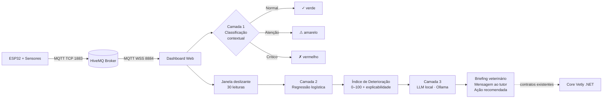

## Equipe

Anna Clara Russo Luca - RM: 561928
Gabriel Duarte Maciel - RM: 565754
Tiago Guedes da Costa - RM: 564731
Gustavo Tavares - RM: 562827

# Vetly collar — Coleira Inteligente Multi-Pet
---

## O problema

O mercado pet brasileiro movimenta cerca de **R$ 75 bilhões por ano** e segue crescendo em dois dígitos. Apesar do volume, o cuidado clínico continua estruturado em torno de eventos pontuais: o tutor leva o animal à clínica quando algo já está visivelmente errado. Entre uma consulta e a próxima, existe um vácuo de meses sem nenhum dado fisiológico — e é justamente nesse intervalo que doenças silenciosas se instalam.

Veterinários sabem disso há décadas, mas faltava um canal escalável para monitoramento contínuo. Tutores percebem mudanças sutis tarde demais. Clínicas perdem janelas críticas de intervenção precoce. O gap entre **consulta pontual** e **monitoramento contínuo** é onde nasce o Velty.

## Solução: Vetly collar

vetly é uma plataforma de saúde veterinária onde possui o foco máximo em diminuir a fricção do trabalho do profissional. o Vetly collar é a solução para o monitoramento da saúde animal 24/7, com o uso constante do nosso equipamento conseguimos gerar dados que ao serem cruzados podem apontar com previsibilidade possíveis problemas de saúde do animal, ou seja, podemos tomar medidas antes que as consequencias cheguem.

O diferencial central é o **multi-espécie por software**: o mesmo hardware mede cão, gato, ave ou coelho — a interpretação clínica é que muda. Uma temperatura de **38.6°C é perfeitamente normal em um cão**, mas é **hipotermia grave em uma ave** (que opera entre 40 e 42°C). O sensor mede; o software se adequa a espécie.

## Por que IoT?

- **Dados longitudinais** — em vez de uma fotografia por consulta, um histórico de dados contínuo que revela padrões e tendências invisíveis a olho nu.
- **Alerta proativo** — taquicardia em repouso, febre noturna, queda abrupta de atividade são detectadas no momento em que acontecem, não dias depois.
- **Escalabilidade** — uma única coleira atende qualquer espécie compatível; a inteligência clínica vive na nuvem e evolui sem mexer no hardware.

## Arquitetura

```
┌─────────────────────────────────────────┐
│ ESP32 (Wokwi)                           │
│  ├─ DS18B20 (GPIO 4)         → temp     │
│  ├─ Potenciômetro (GPIO 34)  → BPM      │
│  └─ MPU6050 (I²C 21/22)      → atividade│
└─────────────────────────────────────────┘
                ↓ MQTT (TCP 1883)
┌─────────────────────────────────────────┐
│ Broker HiveMQ público                   │
│   broker.hivemq.com                     │
└─────────────────────────────────────────┘
                ↓ MQTT (WSS 8884)
┌─────────────────────────────────────────┐
│ Dashboard HTML (navegador, file://)     │
│  Multi-pet · Chart.js
└─────────────────────────────────────────┘
```


```mermaid
flowchart LR
    A[ESP32 + Sensores] -->|MQTT TCP 1883| B[(HiveMQ Broker)]
    B -->|MQTT WSS 8884| C[Dashboard Web]

    C --> D{Camada 1<br/>Classificação<br/>contextual}
    D -->|Normal| E[✓ verde]
    D -->|Atenção| F[⚠ amarelo]
    D -->|Crítico| G[✗ vermelho]

    C --> H[Janela deslizante<br/>30 leituras]
    H --> I[Camada 2<br/>Regressão logística]
    I --> J[Índice de Deterioração<br/>0–100 + explicabilidade]
    J --> K[Camada 3<br/>LLM local · Ollama]
    K --> L[Briefing veterinário<br/>Mensagem ao tutor<br/>Ação recomendada]
    L -.->|contratos existentes| M[Core Vetly .NET]
```

O detalhamento da camada de IA, com diagrama de sequência e fluxo completo de
dados, está em [`ARQUITETURA-IA.md`](ARQUITETURA-IA.md).

## Funcionalidades implementadas no Sprint 1

- ✅ Firmware ESP32 lendo **3 sensores físicos** simultâneos (temperatura, BPM, atividade)
- ✅ Publicação MQTT em **9 tópicos** (3 pets × 3 métricas) a cada 2 segundos
- ✅ **Multi-pet nativo**: 1 pet real (Rex) + 2 virtuais (Mimi gato, Tobi coelho) com ruído gaussiano e drift biológico
- ✅ Dashboard responsivo conectado via **WebSocket Secure** (porta 8884)
- ✅ **Classificação clínica contextual** por espécie (Normal / Atenção / Crítico)
- ✅ **Cruzamento BPM × atividade** detectando taquicardia em repouso
- ✅ Indicadores de **tendência** (↗ ↘ →) nas últimas 5 leituras
- ✅ Gráfico Chart.js com histórico de 30 leituras, **persistente via localStorage**
- ✅ Painel de simulação com **sliders manuais e 5 presets clínicos** por espécie
- ✅ Reconexão automática Wi-Fi + MQTT em duas camadas
- ✅ Mensagens MQTT com `retain: true` para snapshot imediato ao conectar

## Camada de Inteligência Artificial (Sprint 3)

O Sprint 1 entregou um **motor de regras**: ele responde *"este animal está mal
agora?"*. O Sprint 3 adiciona a inteligência que responde *"este animal está
ficando pior?"* e *"o que eu faço com essa informação?"*.

São três camadas, cada uma com a técnica justificada para o seu problema:

| Camada | Técnica | O que entrega |
|---|---|---|
| **1. Classificação instantânea** | Motor de regras por espécie *(Sprint 1, preservado)* | Normal / Atenção / Crítico sobre a leitura atual |
| **2. Índice de Deterioração** | **Regressão logística** sobre 6 features de janela deslizante | Score 0–100 de probabilidade de deterioração clínica, **antes** de qualquer valor cruzar o limiar |
| **3. Vetly Insights** | **LLM local via Ollama** (`llama3.2`) | O mesmo quadro clínico traduzido para 3 públicos: veterinário, tutor e sistema |

### O Índice de Deterioração

Uma regressão logística consome as últimas 30 leituras e devolve um score de 0 a
100. A diferença essencial em relação ao motor de regras:

> **As regras olham o instante. O modelo olha a trajetória.**

As 6 features são todas relativas ao perfil da espécie e normalizadas em [0,1]:

| # | Feature | O que captura |
|---|---|---|
| 1 | `desvio_termico` | Febre ou hipotermia relativas à espécie |
| 2 | `desvio_bpm` | Taquicardia ou bradicardia relativas à espécie |
| 3 | `variabilidade_bpm` | Instabilidade autonômica |
| 4 | `queda_atividade` | **IoB** — letargia, primeiro sinal comportamental de dor e doença |
| 5 | `fragmentacao_repouso` | **IoB** — sono agitado, inquietação, desconforto |
| 6 | `taquicardia_repouso` | O diferencial do Sprint 1, agora como sinal contínuo |

As features 4 e 5 são o **argumento de IoB** da entrega: o acelerômetro deixa de
ser enfeite e passa a medir *comportamento*, não só fisiologia. O modelo confirma
a intuição clínica — `queda_atividade` é a feature de maior peso (40,3% da
importância relativa).

O dashboard **nunca mostra o score sozinho**: as 3 maiores contribuições
(coeficiente × valor) são exibidas junto, com barras proporcionais. IA em saúde
não pode ser caixa-preta.

### Vetly Insights (IA generativa)

Um clique envia o estado clínico completo a um LLM rodando **localmente** e recebe
três saídas estruturadas em JSON: briefing técnico para o veterinário, mensagem
acolhedora para o tutor, e uma ação operacional (`OBSERVAR` / `AGENDAR` /
`URGENCIA`). Detalhes de engenharia:

- **`temperature: 0.2`** — contexto clínico exige previsibilidade, não criatividade
- **`format: "json"`** — força saída estruturada e consumível por código
- **Grounding por espécie** — o prompt sempre injeta as faixas fisiológicas do
  paciente; sem isso o LLM avaliaria uma ave com régua de cão e erraria com confiança
- **Timeout de 8 s + fallback determinístico** — se o Ollama estiver fora do ar,
  o painel gera as três saídas por template e exibe o selo *"modo offline"*. A
  demonstração nunca quebra
- **Log de auditoria** em `localStorage`, espelhando o `LogAuditoriaIa` do backend
- **Privacidade por design** — nenhum dado clínico sai da máquina

### Guardrails (RN-082)

A IA **sugere**; o veterinário **valida**. Nenhuma saída da IA altera estado
clínico automaticamente, o prompt proíbe explicitamente diagnóstico definitivo e
prescrição, e os payloads de orientação seguem marcados como
`validadoPorProfissional: false`.

### Documentação técnica completa

| Documento | Conteúdo |
|---|---|
| [`ARQUITETURA-IA.md`](ARQUITETURA-IA.md) | Problema de negócio, justificativa de cada técnica, diagramas, prompt engineering, guardrails, integração com o .NET |
| [`DADOS-IA.md`](DADOS-IA.md) | Dicionário de dados, pipeline de transformação com exemplo numérico real, escala temporal, dataset sintético, LGPD |
| [`ia/METRICAS.md`](ia/METRICAS.md) | Métricas reais do modelo, importância das features, limitações |
| [`ia/README.md`](ia/README.md) | Como rodar e interpretar o pipeline de treino |
| [`ROTEIRO-VIDEO.md`](ROTEIRO-VIDEO.md) | Roteiro cronometrado de 5 minutos + checklist pré-gravação |

## Stack técnico

| Tecnologia | Versão | Finalidade |
|---|---|---|
| ESP32 DevKit-C v4 | Arduino core | Microcontrolador principal (simulado no Wokwi) |
| DS18B20 | OneWire 1-wire | Sensor de temperatura |
| MPU6050 | I²C | Acelerômetro para índice de atividade |
| PubSubClient | 2.8+ | Cliente MQTT no firmware |
| HiveMQ público | broker.hivemq.com | Broker MQTT (portas 1883 / 8884) |
| Chart.js | 4.4.0 | Gráficos de séries temporais no dashboard |
| mqtt.js | CDN unpkg | Cliente MQTT no navegador (WSS) |
| HTML/CSS/JS | Vanilla | Frontend sem build step |
| scikit-learn | 1.4.2 | Treino da regressão logística (Índice de Deterioração) |
| pandas / numpy | 2.2.3 / 1.26.4 | Geração do dataset sintético e engenharia de atributos |
| matplotlib | 3.9.2 | Curva ROC e matriz de confusão |
| Ollama + llama3.2 | local | IA generativa do Vetly Insights (`localhost:11434`) |
| Node.js | 18+ | Executa o teste de paridade Python ↔ JavaScript |

## Como executar

### A. Rodar o firmware no Wokwi

1. Acesse [wokwi.com](https://wokwi.com) e crie um **novo projeto ESP32**.
2. Copie o conteúdo de `sketch.ino` para a aba `sketch.ino` do Wokwi.
3. Copie `diagram.json` para a aba `diagram.json` (define o circuito visual).
4. No Library Manager do Wokwi (ícone de livro), adicione:
   - `PubSubClient`
   - `OneWire`
   - `DallasTemperature`
   - `Adafruit MPU6050`
   - `Adafruit Unified Sensor`
5. Clique em **Play** ▶. O Serial Monitor deve mostrar conexão Wi-Fi e MQTT em poucos segundos.

```bash
# Saída esperada no Serial Monitor:
# [WiFi] Conectado | IP: 10.0.0.2
# [MQTT] Conectado ao broker.hivemq.com
# [PUB] vetlycollar/pet001/temperatura 38.4
# [PUB] vetlycollar/pet001/bpm 92
# [PUB] vetlycollar/pet001/atividade 0.42
```

### B. Abrir o dashboard

1. Baixe o arquivo `index.html` para qualquer pasta local.
2. Dê **duplo clique** no arquivo — abre direto no navegador via `file://`.
3. O dashboard conecta automaticamente ao broker e começa a receber os 3 pets em segundos.

Não precisa de servidor, sem `npm install`, sem build. Funciona offline depois do primeiro carregamento das CDNs.

O **Índice de Deterioração** já funciona neste ponto — ele roda inteiramente no
navegador, com os coeficientes embutidos no próprio `index.html`. Aguarde ~20
segundos para a janela acumular 10 leituras e o card sair do estado "Coletando
dados". O **Vetly Insights** precisa do Ollama (passo C).

### C. Instalar e configurar o Ollama (para o Vetly Insights)

O Vetly Insights usa um LLM rodando **localmente** — nenhum dado clínico sai da
sua máquina. Sem o Ollama o painel continua funcionando, mas em modo *fallback*
por template.

**1. Instale o Ollama** em [ollama.com/download](https://ollama.com/download) e
baixe o modelo:

```bash
ollama pull llama3.2
```

**2. Libere o CORS — passo obrigatório.** O dashboard é aberto via `file://`, o
que faz o navegador enviar a origem `null`. Sem liberar as origens, o Ollama
rejeita a requisição e o painel cai direto no modo offline.

<details open>
<summary><strong>Windows (PowerShell)</strong></summary>

```powershell
setx OLLAMA_ORIGINS "*"
```
Depois **feche e reabra o Ollama** (ícone na bandeja → Quit → abrir de novo).
A variável só vale para processos iniciados após o `setx`.
</details>

<details>
<summary><strong>macOS</strong></summary>

```bash
launchctl setenv OLLAMA_ORIGINS "*"
```
Depois reinicie o aplicativo Ollama.
</details>

<details>
<summary><strong>Linux</strong></summary>

```bash
OLLAMA_ORIGINS="*" ollama serve
```
Ou, se estiver rodando como serviço systemd, adicione
`Environment="OLLAMA_ORIGINS=*"` ao unit file e rode
`sudo systemctl daemon-reload && sudo systemctl restart ollama`.
</details>

**3. Verifique** que o serviço responde:

```bash
curl http://localhost:11434/api/tags
```

Com isso pronto, o botão **"Gerar análise com IA"** no dashboard passa a usar o
LLM. O rodapé do painel mostra a origem da geração (`Ollama llama3.2` ou
`modo offline`).

> `OLLAMA_ORIGINS="*"` libera qualquer origem e é adequado para uso local de
> demonstração. Num ambiente compartilhado, restrinja às origens necessárias.

### D. Retreinar o modelo (opcional)

O repositório já vem com o modelo treinado e embutido no `index.html`. Para
reproduzir o pipeline do zero:

```bash
pip install -r ia/requirements.txt
python ia/gerar_dataset.py            # gera o CSV com 4.000 amostras
python ia/treinar_modelo.py           # treina, avalia e injeta no index.html
node ia/verificar_paridade.js         # valida a paridade Python <-> JavaScript
python ia/verificar_base_saudavel.py  # valida o score de base em animais saudáveis
```

Tudo é determinístico (`random_state=42`) — rodar de novo produz exatamente os
mesmos números. Detalhes em [`ia/README.md`](ia/README.md).

> ⚠️ `treinar_modelo.py` reescreve automaticamente o bloco entre os marcadores
> `MODELO-IA:INICIO` e `MODELO-IA:FIM` do `index.html`. Não edite aquele bloco à mão.

## Demonstração multi-espécie

Cenários guiados que evidenciam o diferencial contextual da plataforma:

1. **Mesmo BPM, diagnósticos opostos** — Com o Rex (cão) selecionado, ajuste o BPM virtualmente para `200`. Status: **Crítico** (acima de 140). Troque para a Mimi (gato): mesmos `200` viram **Atenção** (faixa de gato vai até 220). Troque para um perfil de ave: `200` agora é **Crítico por baixo** (aves começam em 250).

2. **Temperatura idêntica, leituras opostas** — Defina `38.6°C` no Rex → **Normal**. Reclassifique o pet como ave → **Hipotermia crítica** (ave saudável opera entre 40 e 42°C). O número não mudou; o contexto sim.

3. **Cruzamento BPM × atividade** — Aplique o preset *Taquicardia* no Tobi (coelho) com atividade em **Repouso**. O dashboard exibe o alerta: **"Taquicardia em repouso — sinal clínico relevante"**. Mude a atividade para **Em movimento** e o alerta desaparece: o mesmo BPM agora tem explicação fisiológica.

4. **Recuperação visual** — Aplique o preset *Febre* no Rex, observe o gráfico subir e o card ficar vermelho. Aplique *Saudável*: o gráfico desce em rampa suave (não em degrau), porque o pet virtual aplica drift gradual — parece biológico.

## Inteligência cruzada (recurso destaque)

O ponto alto clínico do Sprint 1 é o **cruzamento BPM × atividade**. Frequência cardíaca isolada diz pouco: um cão com 180 bpm correndo está fisiologicamente normal; o mesmo cão com 180 bpm dormindo tem alta probabilidade de patologia cardíaca, hipertireoidismo ou dor.

O algoritmo aplica três regras combinadas:

| BPM | Atividade | Interpretação |
|---|---|---|
| Alto para a espécie | Repouso | **Taquicardia em repouso** — alerta clínico relevante |
| Alto para a espécie | Movimento | Esperado (esforço físico) |
| Baixo para a espécie | Repouso | Possível bradicardia — monitorar |
| Baixo para a espécie | Movimento | **Anomalia grave** — escalada imediata |

Esse cruzamento muda a gravidade do status mesmo quando os valores brutos não disparariam alerta sozinhos. É a diferença entre um *monitor de números* e uma *coleira clínica*.

### Perfis clínicos implementados

| Espécie | Temperatura (°C) | BPM (repouso) |
|---|---|---|
| Cão | 37.5 – 39.2 | 60 – 140 |
| Gato | 38.0 – 39.2 | 140 – 220 |
| Bovino | 38.0 – 39.5 | 40 – 80 |
| Ave | 40.0 – 42.0 | 250 – 400 |
| Coelho | 38.5 – 40.0 | 130 – 325 |

**Regra de classificação:** Normal se ambos dentro da faixa; Atenção se desvio ≤ 5% do limite; Crítico se desvio > 5%. Quando ambos estão fora, prevalece o pior caso.

## Resultados do Sprint 1

Autoavaliação contra os critérios da rubrica:

| Critério | Avaliação | Evidência |
|---|---|---|
| Funcionalidade do MVP | ✅ Atende plenamente | 3 sensores físicos + 3 pets simultâneos publicando em 9 tópicos MQTT, dashboard recebendo em tempo real |
| Integração IoT ponta-a-ponta | ✅ Atende plenamente | ESP32 → HiveMQ → Browser via WSS, com reconexão automática e mensagens `retain` |
| Diferencial técnico defensável | ✅ Atende plenamente | Multi-espécie contextual + cruzamento BPM × atividade implementado e demonstrável ao vivo |

## Resultados do Sprint 3

### Métricas reais do modelo

Regressão logística treinada sobre 4.000 janelas sintéticas, split estratificado
80/20, avaliada em 800 amostras de teste. Todos os números abaixo vêm da execução
real de `ia/treinar_modelo.py` — nenhum foi editado à mão.

| Métrica | Valor |
|---|---|
| **AUC-ROC** | **0,9997** |
| Acurácia | 0,9862 |
| Precisão | 1,0000 |
| Recall | 0,9725 |
| F1-score | 0,9861 |

**Matriz de confusão** (800 amostras de teste):

|  | Predito: Saudável | Predito: Risco |
|---|---|---|
| **Real: Saudável** | 400 | 0 |
| **Real: Risco** | 11 | 389 |

> ⚠️ **Como ler um AUC de 0,9997.** Ele **não** significa que o modelo é quase
> perfeito clinicamente. Significa que os cenários sintéticos são bem separáveis
> pelas features projetadas para separá-los. Em dados reais — com comorbidades,
> variação individual e rótulos ambíguos — o desempenho seria substancialmente
> menor. Leia estas métricas como validação de que o *pipeline* funciona, não como
> estimativa de acurácia clínica.

**Importância relativa das features** (coeficientes do modelo):

| Feature | Coeficiente | Importância |
|---|---|---|
| Queda de atividade (IoB) | +13,3322 | 40,3% |
| Desvio térmico | +8,7709 | 26,5% |
| Variabilidade de BPM | +4,0994 | 12,4% |
| Taquicardia em repouso | +2,5949 | 7,8% |
| Fragmentação do repouso (IoB) | +2,3093 | 7,0% |
| Desvio de BPM | −2,0020 | 6,0% |

> O coeficiente **negativo** de `desvio_bpm` não é um erro — é o resultado mais
> interessante do treino. O dataset inclui deliberadamente um cenário de
> *atividade intensa* (BPM alto **com** movimento, rotulado como saudável). O
> modelo aprendeu sozinho que desvio de BPM isolado não é evidência de risco, e
> que o sinal clínico está em `taquicardia_repouso` (+2,5949) — o BPM alto
> **qualificado pelo estado comportamental**. É exatamente o diferencial clínico
> do produto, agora aprendido a partir dos dados em vez de codificado à mão.

### Correção de calibração da fragmentação do repouso

A feature `fragmentacao_repouso` tinha um defeito: `LIMIAR_ATIVO` (0,25) fica colado
na atividade basal do cão (0,30) e **exatamente em cima** da do bovino (0,25). Com o
ruído normal do sensor, um animal saudável trocava de estado a cada leitura e a
feature saturava em 1,0 — levando animais saudáveis à faixa de Vigilância sem nada
de errado acontecer. O mesmo cálculo estava no gerador do dataset, então o defeito
contaminou o treino.

Corrigido com **histerese** (uma troca só conta se o novo estado durar ≥ 2 leituras)
e **referência por espécie** (`FRAGMENTACAO_REF` calibrado por
`ia/calibrar_fragmentacao.py`). Janelas saudáveis que entravam em Vigilância:

| Espécie | Antes | Depois |
|---|---|---|
| Bovino | 19,7% | **0,0%** |
| Cão | 16,3% | **0,0%** |
| Gato | 7,0% | **1,0%** |
| Coelho | 1,0% | **0,0%** |
| Ave | 0,0% | **0,0%** |

Verificado por `ia/verificar_base_saudavel.py`, que roda como teste de regressão e
falha se qualquer espécie ultrapassar 2%. Detalhes em `DADOS-IA.md` §2.3.

### O modelo antecipa a regra

O Modo Demonstração injeta uma deterioração em duas fases: primeiro um **pródromo
comportamental** (atividade despencando e repouso fragmentado, com temperatura e
BPM ainda **dentro** da faixa da espécie), depois a **descompensação fisiológica**
(quando os valores finalmente cruzam os limiares).

Medição real partindo de uma janela limpa de 30 leituras saudáveis de cão
(baseline: **3,3**, faixa Estável; reproduzida em 5 execuções consecutivas):

| Marco | Passo | Motor de regras nesse momento |
|---|---|---|
| Índice cruza 40 (**Vigilância**) | **11** | Normal |
| Índice cruza 70 (**Deterioração**) | **14** | Atenção |
| Regras mudam para **Crítico** | 15–16 | — |

**O índice entra em Vigilância no passo 11, enquanto as regras ainda dizem Normal**
— 3 passos antes de o motor de regras reagir de qualquer forma, e 4 a 5 passos antes
do alerta crítico.

A antecipação é **estrutural, não acidental**: durante toda a fase 1 os valores de
temperatura e BPM estão dentro do normal, então nenhuma regra sobre faixas
conseguiria detectá-la. O modelo detecta porque enxerga **comportamento** — e o
comportamento se deteriora antes da fisiologia.

> **Nota honesta:** antes da correção de calibração da `fragmentacao_repouso`, esta
> medição mostrava uma antecipação maior (índice em Vigilância já no passo 6). Boa
> parte daquela margem era artefato do próprio defeito: a feature saturada inflava o
> score de base de qualquer animal, inclusive saudável, e fazia o índice "largar na
> frente". Com o defeito corrigido a margem diminuiu — e passou a ser real.

### Paridade Python ↔ JavaScript

O modelo é treinado em Python e executado em JavaScript. Um teste automatizado
garante que as duas implementações produzem o mesmo score:

```
$ node ia/verificar_paridade.js
✓ Paridade Python ↔ JavaScript verificada: 20/20 casos
  Tolerância aplicada: 0.000001
```

### Autoavaliação contra a rubrica

| Critério | Pontos | Avaliação | Evidência concreta |
|---|---|---|---|
| **Aplicação técnica de conceitos de IA** | até 60 | ✅ Atende plenamente | Pipeline completo de ML: dataset sintético reprodutível (4.000 amostras, seed fixa) → engenharia de 6 atributos normalizados → regressão logística (**AUC 0,9997**) → exportação de coeficientes → inferência no navegador → **teste de paridade automatizado 20/20**. Camada generativa com LLM local, prompt com grounding por espécie, saída estruturada em JSON, fallback determinístico e log de auditoria. Duas features de **IoB** extraídas do acelerômetro, sendo a de maior peso do modelo. |
| **Clareza e didática da apresentação** | até 20 | ✅ Atende plenamente | [`ROTEIRO-VIDEO.md`](ROTEIRO-VIDEO.md) com 7 blocos cronometrados, falas prontas, checklist pré-gravação e respostas de reserva. **Modo Demonstração** de um clique que torna o diferencial visível ao vivo: o índice sobe antes do alerta de regra. Explicabilidade renderizada na tela (3 maiores contribuições com barras). |
| **Organização do repositório e documentação** | até 20 | ✅ Atende plenamente | 5 documentos técnicos cobrindo as 6 exigências do enunciado; pasta `ia/` com README próprio e ordem de execução; diagramas Mermaid (arquitetura + sequência); dicionário de dados completo com exemplo numérico real; limitações declaradas com honestidade (dados sintéticos, escala temporal comprimida, recall de 0,755, suposições de DTO marcadas). |

**Cobertura das exigências do enunciado:**

| Exigência | Onde está |
|---|---|
| Definir o problema de negócio tratado pela IA | `ARQUITETURA-IA.md` §1 |
| Contribuição para personalização, priorização, recomendação e apoio à decisão | `ARQUITETURA-IA.md` §1 (tabela) |
| Fluxo de dados entre usuários, aplicação, banco e componentes de IA | `ARQUITETURA-IA.md` §3 e §3.1 (diagramas) |
| Identificar e documentar os dados que alimentam a IA | `DADOS-IA.md` §1 e §2 |
| Escolher e **justificar tecnicamente** a abordagem de IA | `ARQUITETURA-IA.md` §2 (tabela comparativa) |
| Diagrama arquitetural (aplicação, banco, APIs, componentes de IA) | `ARQUITETURA-IA.md` §3 |

## Limitações conhecidas

Declaradas de forma explícita — ver detalhamento em `ARQUITETURA-IA.md` §7.

1. **O modelo foi treinado em dados sintéticos.** Não existe base pública de
   telemetria contínua multi-espécie rotulada. As métricas medem a separabilidade
   dos cenários simulados, não desempenho clínico real.
2. **11 falsos negativos em 400 janelas de risco (recall 0,9725), com zero falsos
   positivos.** Para triagem clínica o trade-off deveria ser invertido: falso
   negativo custa mais que falso alarme. `class_weight='balanced'` foi testado e não
   altera nada (dataset balanceado por construção); a alavanca real é o limiar.
3. **Escala temporal comprimida.** 30 leituras ≈ 60 s na simulação; em produção
   representariam ~24 h. A matemática é idêntica — ver `DADOS-IA.md` §3.
4. **Atividades basais por espécie são estimativas** documentadas, não medições
   de campo.
5. **Nomes dos campos dos DTOs .NET não verificados** — as suposições estão
   marcadas em `ARQUITETURA-IA.md` §6.1.
6. **Broker MQTT público e sem criptografia de payload** — limitação assumida da
   demonstração acadêmica.

## Roadmap

- ✅ **Sprint 1 — entregue.** Firmware ESP32 com 3 sensores, publicação MQTT em 9
  tópicos, dashboard multi-pet com classificação clínica contextual por espécie e
  cruzamento BPM × atividade.
- ✅ **Sprint 2 — entregue.** Camada preditiva: Índice de Deterioração por
  regressão logística sobre janela deslizante, com 6 features (2 delas de IoB),
  explicabilidade por contribuição e detecção de deterioração **antes** do limiar
  crítico. AUC 0,9997, com teste de paridade Python ↔ JavaScript e teste de
  regressão do score de base em animais saudáveis.
- ✅ **Sprint 3 — entregue.** IA generativa (Vetly Insights) traduzindo o estado
  clínico em três linguagens via LLM local, com guardrails de RN-082, fallback
  determinístico, log de auditoria e payloads prontos para os contratos do core .NET.
- 🔜 **Próximos passos.** Substituir o dataset sintético por telemetria real
  rotulada por veterinários; mover a inferência do LLM para o backend reutilizando
  o `IOllamaService`; estender a janela para a escala de 24 h; aprender a atividade
  basal **do indivíduo** em vez da espécie; app do tutor com notificações e
  histórico exportável.


