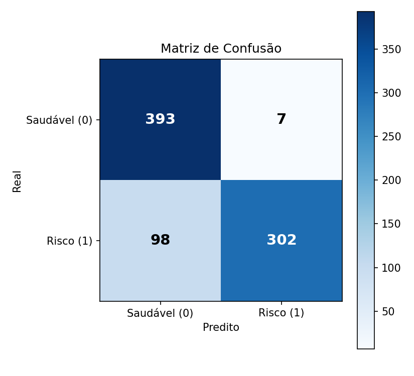
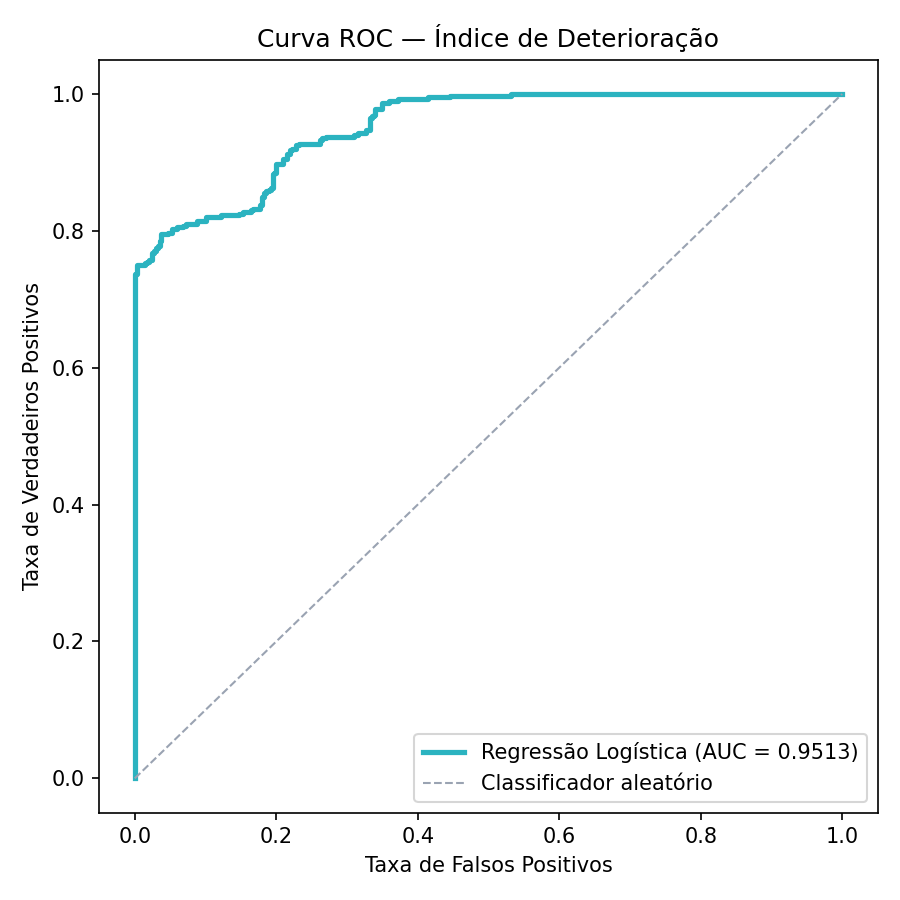

# Métricas do Modelo — Índice de Deterioração

Resultados reais da execução de `treinar_modelo.py` sobre `dataset_sintetico.csv`
(4.000 amostras, split estratificado 80/20, `random_state=42`). Nenhum número
nesta página foi editado manualmente — todos vêm da saída do script de treino.

## Métricas no conjunto de teste (800 amostras)

| Métrica | Valor | Interpretação |
|---|---|---|
| Acurácia | 0.8688 | Fração total de janelas classificadas corretamente (saudável vs. risco) |
| Precisão | 0.9773 | Das janelas que o modelo marcou como risco, esta fração realmente era risco — mede o custo de falsos alarmes |
| Recall (sensibilidade) | 0.7550 | Das janelas que realmente eram de risco, esta fração foi detectada — mede o custo de deteriorações não percebidas |
| F1-score | 0.8519 | Média harmônica entre precisão e recall — resume o equilíbrio entre os dois erros |
| AUC-ROC | 0.9513 | Capacidade do modelo de separar as duas classes em todos os limiares possíveis; 1.0 é separação perfeita, 0.5 é aleatório |

## Matriz de confusão

|  | Predito: Saudável | Predito: Risco |
|---|---|---|
| **Real: Saudável** | 393 (verdadeiro negativo) | 7 (falso positivo) |
| **Real: Risco** | 98 (falso negativo) | 302 (verdadeiro positivo) |

## Curva ROC

## Importância relativa das features

Ordenadas pelo valor absoluto do coeficiente da regressão logística (features
estão todas em faixas comparáveis [0,1], então os coeficientes são diretamente
comparáveis entre si sem necessidade de normalização adicional).

| Feature | Coeficiente | Importância relativa | Efeito |
|---|---|---|---|
| Queda de atividade (IoB) | +8.1787 | 30.8% | aumenta o risco |
| Desvio térmico | +7.4865 | 28.2% | aumenta o risco |
| Variabilidade de BPM | +3.9706 | 14.9% | aumenta o risco |
| Taquicardia em repouso | +3.4613 | 13.0% | aumenta o risco |
| Fragmentação do repouso (IoB) | +2.7517 | 10.4% | aumenta o risco |
| Desvio de BPM | -0.7144 | 2.7% | reduz o risco |

Intercepto do modelo: `-3.7051`

## Limitações

- **Dados sintéticos.** O modelo foi treinado inteiramente sobre janelas geradas
  por simulação estatística de cenários clínicos (`gerar_dataset.py`), não sobre
  telemetria real de animais. A separabilidade das classes reflete o desenho dos
  cenários, não necessariamente a variabilidade biológica real de uma população
  de pacientes.
- **Não substitui avaliação veterinária.** Conforme a RN-082 do backend Vetly,
  este índice é uma sugestão de apoio à decisão. Nenhuma ação clínica deve ser
  tomada com base apenas no score — o veterinário valida.
- **Escala temporal comprimida na demo.** A janela de 30 leituras representa
  ~60 segundos na simulação do Wokwi (publicação a cada 2s), enquanto em produção
  representaria uma janela comportamental de ~24h. Ver `DADOS-IA.md`, seção
  "Escala temporal: simulação vs. produção".
- **5 espécies, faixas fixas.** O modelo não generaliza para espécies fora do
  objeto `PERFIS`; qualquer nova espécie exige novas faixas fisiológicas e,
  idealmente, retreino com cenários específicos.
- **Basais de atividade estimadas.** Os valores de `ATIVIDADE_BASAL` por espécie
  (usados na feature `queda_atividade`) são estimativas documentadas, não medições
  de campo — ver `DADOS-IA.md`.
